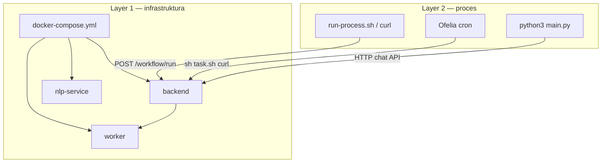

# Autonomiczny stack — dwie warstwy

## Warstwa 1 — infrastruktura (Docker Compose)

**Cel:** uruchomić platformę NLP2DSL (serwisy, sieć, baza).

| Serwis | Rola |
|--------|------|
| `backend` | API gateway, `/workflow/run` |
| `nlp-service` | NLP → DSL, chat, autofill |
| `worker` | wykonanie kroków (send_invoice, …) |
| `postgres`, `redis` | persystencja |

```bash
cd ~/github/wronai/nlp2dsl
examples/13-autonomous-invoice-stack/.nlp2dsl/generated/up-platform.sh
# albo: docker compose up -d
```

To **nie** jest jeszcze proces biznesowy — tylko środowisko.

---

## Warstwa 2 — proces (shell / curl / python)

**Cel:** wykonać workflow **w ramach** działającej platformy.

| Sposób | Narzędzie | Gdzie |
|--------|-----------|--------|
| Host | `run-process.sh` (curl → `localhost:8010`) | maszyna deweloperska |
| Kontener jednorazowy | `process-shell` (curl → `backend:8000`) | sieć Docker |
| Harmonogram | Ofelia + `run-process-docker.sh` | cron w `autonomous-invoice-stack-cron` |
| Python (dev) | `python3 main.py` w `examples/…` | host → API platformy |

SDK `wait_for_health()` czeka na backend `:8010`, nlp `:8012`, worker `:8004` przed scenariuszem.

### Jednorazowo (host)

```bash
sh examples/13-autonomous-invoice-stack/.nlp2dsl/generated/run-process.sh
```

### Jednorazowo (w sieci Docker — curl w kontenerze)

```bash
examples/13-autonomous-invoice-stack/.nlp2dsl/generated/run-process-in-docker.sh
```

### Cyklicznie (cron)

```bash
examples/13-autonomous-invoice-stack/.nlp2dsl/generated/up-stack.sh
# Layer 1 (jeśli trzeba) + Layer 2 scheduler (Ofelia)
```

---

## Diagram



---

## Zasada

> **Docker Compose = środowisko.**  
> **Shell/curl/python = proces** uruchamiany *wewnątrz* tego środowiska (przez sieć Docker lub port hosta).

Nie uruchamiaj drugiej kopii platformy — dodawaj tylko warstwę procesu (`process-shell`, cron) do tego samego projektu `nlp2dsl`.
