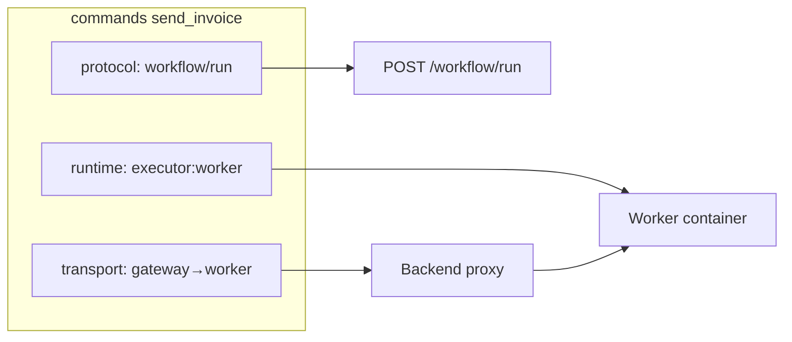

# DOQL runtimes — gdzie wykonuje się efekt komendy

## Problem

Wcześniejsze wersje `environment.doql.less` opisywały komendy tylko przez **transport** sieciowy:

```less
commands[0] {
  name: "send_invoice";
  transport: "backend→worker";
  endpoint: "POST /workflow/run";
}
```

`transport` mówi, **jak idzie HTTP** między serwisami. Nie mówi:

- **gdzie** wykonuje się efekt (worker, Mullm, system executor, LLM),
- **czy runtime jest dostępny** w danym profilu Docker,
- **jakie role** pełni (parsowanie NL, dispatch workflow, symulacja SMTP).

## Trzy pojęcia

| Pojęcie | Przykład | Znaczenie |
|---------|----------|-----------|
| **runtime** | `executor:worker` | Miejsce wykonania efektu komendy |
| **protocol** | `workflow/run` | Kontrakt CMD (Propact / workflow MVP) |
| **transport** | `gateway:backend→executor:worker` | Ścieżka sieciowa między serwisami |



## Sekcja `runtimes[N]`

Katalog dostępnych środowisk wykonania dla przykładu. Generowany z:

- [`examples/example-profiles.yaml`](../examples/example-profiles.yaml) — `services`, `docker_profiles`,
- zmiennych env (`NLP2DSL_BACKEND_URL`, `LLM_MODEL`, …),
- opcjonalnie health checków API (docelowo).

```less
runtimes[0] {
  id: "orchestrator:nlp-service";
  kind: "orchestrator";
  url: "http://localhost:8012";
  health: "GET /health";
  roles: "nlp_parse,dsl_map,autofill,preflight";
  status: "available";
}

runtimes[2] {
  id: "executor:worker";
  kind: "worker";
  url: "http://localhost:8004";
  docker_profile: "invoice";
  roles: "send_invoice,generate_invoice,send_email,...";
  status: "available";
}

runtimes[7] {
  id: "delegate:mullm";
  kind: "external";
  roles: "filesystem,rag,shell_delegated";
  status: "unavailable";
}
```

### Pola `RuntimeSpecIR`

| Pole | Opis |
|------|------|
| `id` | Identyfikator referencyjny (`executor:worker`) |
| `kind` | `orchestrator` \| `gateway` \| `worker` \| `llm` \| `database` \| `cache` \| `mock` \| `external` |
| `url` / `uri` | Endpoint HTTP lub connection string |
| `health` | Ścieżka health check |
| `docker_profile` | Profile compose wymagane do uruchomienia |
| `model` | Model LLM (dla `kind: llm`) |
| `roles` | Co runtime obsługuje |
| `status` | `available` \| `unavailable` \| `unknown` |

## Komenda z `runtime`

```less
commands[0] {
  name: "send_invoice";
  description: "Generuje i wysyła fakturę";
  runtime: "executor:worker";
  protocol: "workflow/run";
  transport: "gateway:backend→executor:worker";
  endpoint: "POST /workflow/run";
  input_model: "SendInvoiceConfig";
  required: "amount,to";
  optional: "currency,attachment_path";
}
```

Mapowanie bootstrap (SDK):

| Akcja | Runtime domyślny |
|-------|------------------|
| `send_invoice`, `generate_invoice`, notify_* | `executor:worker` |
| `system_*` | `orchestrator:nlp-service` |
| `mullm_*` | `delegate:mullm` |

Kod: `nlp2dsl_sdk/system_map_runtimes.py` — `resolve_command_runtime()`, `build_runtimes_for_example()`.

## Przykład `01-invoice`

Profil Docker `invoice` uruchamia: `backend`, `nlp-service`, `worker`, `postgres`, `redis`, `smtp-mock`.

Po `ExampleArtifactWriter.finalize()` plik `.nlp2dsl/environment.doql.less` zawiera sekcję `runtimes[]` wygenerowaną z profilu.

Regeneracja:

```bash
cd examples/01-invoice && python3 main.py
# lub
PYTHONPATH=. python -c "
from nlp2dsl_sdk.system_map_generator import generate_system_map
from nlp2dsl_sdk.system_map_render import render_system_map_doql
from pathlib import Path
ir = generate_system_map('examples/01-invoice', example_id='01-invoice')
Path('examples/01-invoice/.nlp2dsl/environment.doql.less').write_text(render_system_map_doql(ir))
"
```

## Powiązanie z wykonaniem

Dziś `nlp-service/app/execution/delegate.py` wybiera backend po mapie DOQL (runtime) z fallbackiem intent.

**Registry loop:** po każdym kroku `environment.doql.less` jest aktualizowany — zob. [`process-agent.md`](process-agent.md) (sekcja „Źródło prawdy”).

SDK: `nlp2dsl_sdk/doql_registry.py` — `refresh_doql_registry()`.

## Powiązane

- [`doql-system-map.md`](doql-system-map.md) — pełna mapa systemu
- [`doql-dynamic-generation.md`](doql-dynamic-generation.md) — LLM → SystemMapIR
- [`examples/example-profiles.yaml`](../examples/example-profiles.yaml) — źródło runtimes bootstrap
