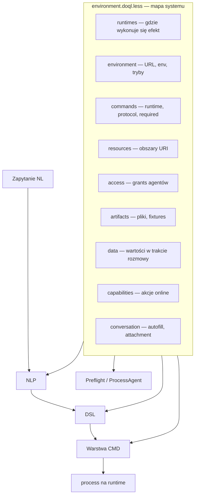

# DOQL system map — `environment.doql.less`

## Istota nlp2dsl

nlp2dsl **generuje poprawne struktury** i na ich podstawie **kolejne struktury**, które mają wywoływać właściwe **komendy** (CMD). Każda warstwa musi być zgodna ze schematem dostępnego systemu.

```
NL (język)  →  NLP (intencja + entities)
            →  DSL (WorkflowDSL — kroki + config)
            →  CMD (action + runtime + protocol + transport)
            →  process (wykonanie na runtime)
```

**`environment.doql.less`** to **mapa tego systemu** w danym przykładzie: runtimes, komendy, zasoby, artefakty, dostępy. Orchestrator, mapper i TestQL czytają ją przed uzupełnianiem luk lub walidacją planu.



## Sekcje pliku

| Sekcja | Rola w mapie | Źródło |
|--------|--------------|--------|
| `runtimes[N]` | **Środowiska wykonania** — worker, nlp-service, LLM, postgres, status | `example-profiles.yaml`, env, health |
| `environment[...]` | Połączenie z platformą (backend, NLP, worker) | `os.environ`, profile Docker |
| `commands[N]` | Schemat komend — **runtime**, protocol, pola, transport | `services.yaml`, SystemMapIR |
| `resources[N]` | Zasoby — obszary URI, connector | `nlp2dsl.yaml` |
| `access[N]` | Dostępy — agent, resource_area, effect | `nlp2dsl.yaml` |
| `artifacts[N]` | Pliki, metadane, MIME | `fixtures/` |
| `data { ... }` | Wartości znane w trakcie zadania | fixtures, autofill, historia |
| `capabilities { ... }` | Snapshot akcji z API | `GET /workflow/actions` |
| `workflow_history { ... }` | Stan wykonań | `GET /workflow/history` |
| `conversation { ... }` | Reguły dialogu | profil przykładu |

Szczegóły runtimes: [`doql-runtimes.md`](doql-runtimes.md).

## Przykład (`01-invoice`)

```less
// DOQL system map — 01-invoice

runtimes[2] {
  id: "executor:worker";
  kind: "worker";
  url: "http://localhost:8004";
  docker_profile: "invoice";
  roles: "send_invoice,generate_invoice,...";
  status: "available";
}

environment[name="01-invoice"] {
  NLP2DSL_BACKEND_URL: "http://localhost:8010";
}

data {
  send_invoice.amount: 1500;
  send_invoice.to: "klient@firma.pl";
}

commands[0] {
  name: "send_invoice";
  runtime: "executor:worker";
  protocol: "workflow/run";
  transport: "gateway:backend→executor:worker";
  endpoint: "POST /workflow/run";
  required: "amount,to";
  optional: "currency,attachment_path";
  input_model: "SendInvoiceConfig";
}

conversation {
  autofill: true;
  attachment_required: false;
  generate_invoice_if_missing: true;
  strict_pdf: true;
}
```

Pola `conversation`:

| Pole | Opis |
|------|------|
| `autofill` | Uzupełnianie z bloku `data` w tej samej turze |
| `attachment_required` | Wymusza `attachment_path` przed `ready` |
| `generate_invoice_if_missing` | Nested sync `generate_invoice` |
| `strict_pdf` | Tylko binarny PDF (`%PDF`); domyślnie false (MVP akceptuje też `FAKTURA`) |
| `sync_auto_execute` | Backend wykonuje workflow po `ready` bez „uruchom” |

## Jak mapa steruje generowaniem struktur

1. **NLP → DSL** — mapper vs `commands[N].required`; braki → autofill z `data` lub `incomplete`.
2. **DSL → CMD** — krok mapuje na `commands[N]` (runtime, protocol, endpoint).
3. **Preflight** — ProcessAgent: runtimes online, artifacts, nested sub-process ([`process-agent.md`](process-agent.md)).
4. **Execute** — dispatch na `command.runtime`; zapis w `process/*.process.yaml`.

## Generowanie

Przy `ExampleArtifactWriter.finalize(client)`:

```bash
python3 examples/01-invoice/main.py
# → examples/01-invoice/.nlp2dsl/registry/environment.doql.less
#   (+ mirror examples/01-invoice/.nlp2dsl/environment.doql.less)
```

Kod:

- `nlp2dsl_sdk/system_map_generator.py` — `generate_system_map()`
- `nlp2dsl_sdk/system_map_render.py` — `render_system_map_doql()`
- `nlp2dsl_sdk/system_map_runtimes.py` — bootstrap `runtimes[]`

Zmienna `NLP2DSL_DOQL_CONTEXT` wskazuje aktywną mapę podczas konwersacji.

LLM path: `NLP2DSL_SYSTEM_MAP_LLM=1` — zob. [`doql-dynamic-generation.md`](doql-dynamic-generation.md).

## Registry loop (źródło prawdy w locie)

`environment.doql.less` jest **odświeżany po każdym kroku** procesu:

| Moment | Moduł | `last_phase` |
|--------|-------|--------------|
| Preflight / autofill | `process_agent.preflight_turn` | `preflight` |
| DSL gotowy / incomplete | `orchestrator` → `observe_turn` | `dsl_ready` / `incomplete` |
| Po turze chat (klient) | `ConversationFlow._refresh_doql_registry` | status odpowiedzi |
| Po wykonaniu | `refresh_doql_registry(..., execution=...)` | `executed` |

Kolejna tura czyta zaktualizowany plik (`NLP2DSL_DOQL_CONTEXT`). SDK: `nlp2dsl_sdk/doql_registry.py`.

## Powiązane artefakty

| Plik | Relacja do mapy |
|------|-----------------|
| `services.yaml` | cache `commands` offline |
| `process/*.process.yaml` | wynik DSL→CMD→process |
| `manifest.yaml` | indeks zapytań |
| `nlp2dsl.yaml` | źródło `resources` + `access` |
| `examples/example-profiles.yaml` | źródło `runtimes` bootstrap + `process.conversation.strict_pdf` |

Walidacja pól i załączników wynika z mapy + `conversation`: [`validation.md`](validation.md).

## Stan implementacji

| | Bootstrap (dziś) | Docelowo |
|---|------------------|----------|
| Generator | `generate_system_map()` bootstrap | LLM + introspection |
| Runtimes | `build_runtimes_for_example()` | health check + LLM |
| Walidacja | `registry.py` | `SystemMapIR` + dynamic Pydantic |
| Wykonanie | `execution_backend_for_intent()` | dispatch po `command.runtime` |
| Dialog | orchestrator + DOQL autofill | ProcessAgent |

Szczegóły: [`doql-dynamic-generation.md`](doql-dynamic-generation.md), [`process-agent.md`](process-agent.md).
