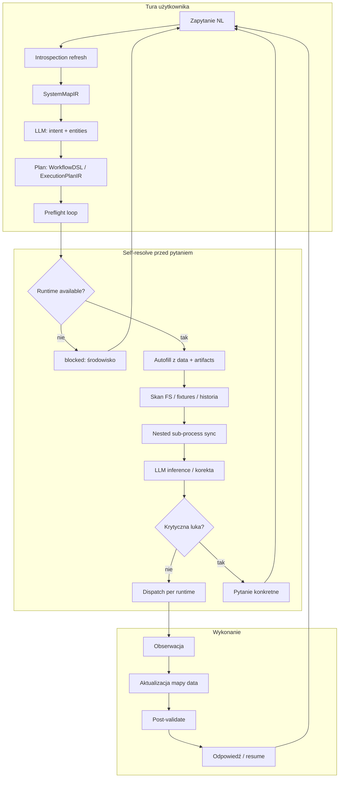

# ProcessAgent — automatyczne wdrożenie dowolnego zapytania NL

## Cel

Użytkownik podaje **dowolne zapytanie w języku naturalnym**. System:

1. dynamicznie pobiera informacje o środowisku (runtimes, komendy, artefakty),
2. planuje wykonanie (NLP → DSL → CMD),
3. **sam rozwiązuje niejasności** zanim zapyta użytkownika,
4. wykonuje proces krok po kroku z obserwacją wyników.

Essencja nlp2dsl: **generowanie poprawnych struktur** zgodnych z mapą systemu (`environment.doql.less` / `SystemMapIR`), nie hardcoded registry.

## Architektura



## Fazy procesu

| Faza | Moduł (dziś / docelowo) | Opis |
|------|-------------------------|------|
| **0. Introspection** | `system_map_generator.py` | Odśwież runtimes, commands, artifacts |
| **1. Understand** | `routing/parser/llm.py` | NL → intent + entities |
| **2. Plan** | `mapper.py` / pact-ir | WorkflowDSL lub ExecutionPlanIR |
| **3. Preflight** | `doql_autofill.py` + docelowy ProcessAgent | plan ↔ stan ↔ mapa |
| **4. Self-resolve** | autofill, nested `generate_invoice`, skan artifacts, **naprawa invalid PDF** | bez pytania usera |
| **5. User gate** | `build_incomplete_response` | tylko reszta luk |
| **6. Execute** | `backend/engine` + `worker` | dispatch po `command.runtime` |
| **7. Observe** | `artifacts.py` process trace | merge wyniku, resume planu |

## Kiedy pytać, kiedy sam rozwiązać

| Sytuacja | Decyzja |
|----------|---------|
| Pole w `data` / fixture | Autofill |
| Brak PDF, `generate_invoice_if_missing` | Nested sync `generate_invoice` (binarny PDF) |
| Niepoprawny PDF (strict / format) | Usuń plik → regenerate → validate ponownie |
| Jeden pasujący artifact | Ustaw `attachment_path` |
| Dwa pasujące pliki | Pytaj: który załącznik |
| Runtime `executor:worker` offline | Komunikat o środowisku, nie o fakturze |
| `access[].effect: approval` | Potwierdzenie przed execute |
| Literówka email, jeden match w historii | Self-correct + informacja |

Reguła: **pytaj dopiero gdy introspection + preflight nie dają jednoznacznej odpowiedzi**.

## Stan implementacji (MVP → docelowy)

### Zaimplementowane

| Komponent | Plik | Status |
|-----------|------|--------|
| `runtimes[]` + `command.runtime` w DOQL | SDK `system_map_*` | ✅ |
| Runtime gate (unavailable) | `runtime_gate.py` | ✅ |
| ProcessAgent preflight | `process_agent.py` | ✅ |
| DOQL ContextVar dla mappera | `system_map.py` | ✅ |
| Mapper: `required` z DOQL | `mapper.py` | ✅ |
| Delegate: backend z runtime | `delegate.py` | ✅ |
| **Registry refresh po kroku** | `doql_registry.py` (SDK + nlp-service) | ✅ |
| Client sync po turze chat | `ConversationFlow._refresh_doql_registry` | ✅ |

### Źródło prawdy — `environment.doql.less`

Po każdej fazie procesu rejestr jest odświeżany:

| Faza | `workflow_history.last_phase` | Co trafia do `data` |
|------|------------------------------|---------------------|
| preflight | `preflight` / `preflight_autofill` | entities z rozmowy |
| dsl_ready | `dsl_ready` | config z WorkflowDSL |
| incomplete | `incomplete` | częściowe entities |
| executed | `executed` | `last_invoice_id`, attachment_path |

Kolejna tura **czyta zaktualizowany plik** (autofill, mapper, runtime gate).

Regeneracja bootstrap: `generate_system_map()` → `environment.doql.less`.
Odświeżanie w locie: `refresh_doql_registry()` / `refresh_registry_for_state()`.

### W toku / planowane

| Komponent | Opis |
|-----------|------|
| Pełny wielokrokowy plan | ExecutionPlanIR |
| LLM clarification | prompt przed `incomplete` |
| Health check runtimes | ✅ `post_health` w pipeline SDK (`runtime_gate`) |
| Modułowy validation pipeline | ✅ `nlp2dsl_sdk/validation/` — zob. [`validation.md`](validation.md) |
| Usunięcie registry jako źródła pól | 🟡 backend/worker używają `/nlp/actions`; nlp-service nadal fallback |

### Dziś (conversation orchestrator)

Pipeline w `nlp-service/app/conversation/orchestrator.py`:

```
resolve_intent → merge → ProcessAgent.preflight_turn → DSL → incomplete/execute
```

`preflight_turn` (`process_agent.py`):

1. ładuje DOQL → `set_doql_context()`
2. sprawdza `runtime_gate` (unavailable → blocked)
3. `sync_autofill_from_doql` (autofill + nested generate_invoice)

### Docelowy ProcessAgent

```python
# docelowy kontrakt (nlp-service/app/conversation/process_agent.py)
async def handle_turn(state: ConversationState, text: str) -> ConversationResponse:
    system_map = await refresh_system_map(state)       # SystemMapIR
    if not runtime_available(system_map, state.intent):
        return blocked_environment(system_map)
    merge_intent(await parse_nl(text, system_map), state)
    await preflight_self_resolve(state, system_map)    # pętla autofill + nested + FS
    dsl = await build_dsl(state, system_map)
    if dsl.missing_fields:
        return ask_user(dsl)                           # ostatnia deska
    if state.ready_to_execute:
        return await execute_and_observe(state, system_map)
    return dsl_response(dsl)
```

## Walidacja trójfazowa

Z [`examples/01-invoice/README.md`](../examples/01-invoice/README.md) i [`validation.md`](validation.md):

1. **Preflight** — mapa + stan świata (runtimes, artifacts, data, runtime_gate)
2. **Kontrakt planu (dsl_ready + pre_execute)** — `step_validator`: required, format, PDF strict, path scope
3. **Post-exec** — `attachment_validation` + `validate_post_execute_execution` (SDK pipeline)

ProcessAgent + `autonomous_loop` operują w fazach 1–2; przy błędzie załącznika regenerują PDF zanim zapytają użytkownika.

## Powiązane moduły SDK

| Plik | Rola |
|------|------|
| `system_map_ir.py` | `RuntimeSpecIR`, `SystemMapIR.runtime_for_command()` |
| `system_map_runtimes.py` | Bootstrap runtimes z example-profiles |
| `system_map_generator.py` | LLM + introspection → mapa |
| `system_map_models.py` | Dynamic Pydantic per command |
| `system_map_render.py` | IR → `environment.doql.less` |

## Kolejność refaktoryzacji

1. ✅ `runtimes[]` + `command.runtime` w DOQL / SystemMapIR
2. ✅ ProcessAgent preflight + runtime gate + DOQL ContextVar
3. ✅ Mapper: `required` z DOQL; delegate z runtime
4. ⬜ Preflight: health check runtimes przed autofill
5. ⬜ LLM clarification prompt (czy da się wywnioskować X?)
6. ⬜ Wielokrokowy plan (raport + email) jako ExecutionPlanIR

## Testowanie

```bash
# SDK — mapa + runtimes
PYTHONPATH=. pytest tests/test_system_map_ir.py -q

# nlp-service — conversation + DOQL
cd nlp-service && pytest tests/test_doql_autofill.py tests/test_doql_attachment.py -q

# E2E przykład
python3 scripts/run-example-docker-e2e.py 01-invoice
```

Zob. też: [`doql-runtimes.md`](doql-runtimes.md), [`doql-system-map.md`](doql-system-map.md).
