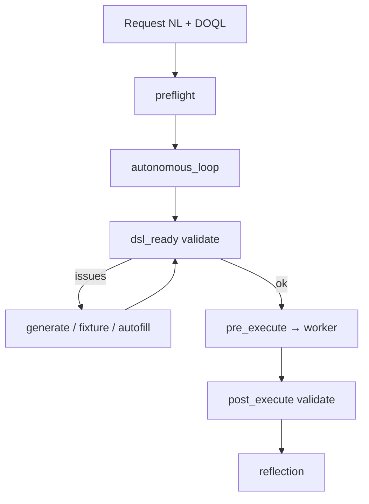

# Walidacja requestu — architektura i rozszerzalność

Każdy request (intent + entities + DOQL) przechodzi przez **walidację opartą o strukturę zapytania** (`SystemMapIR` / `environment.doql.less`). System stara się **sam naprawić** błędy (autofill, fixtures, `generate_invoice`) zanim zapyta użytkownika.

## Fazy walidacji

| Faza | Gdzie | Co sprawdzamy |
|------|-------|---------------|
| `preflight` | `process_agent`, `runtime_gate` | runtime dostępny, scope ACL, intract |
| `dsl_ready` | `build_and_check_dsl`, `step_validator` | required fields, format (email, amount), załącznik PDF |
| `pre_execute` | `backend/engine.py` | powtórka kontraktu przed dispatch do workera |
| `post_execute` | `ensure_attachment_validation` (backend) | załącznik po workerze, spójność wyniku |
| `post_health` | `runtime_gate`, `validate_post_health_*` | `GET /health` runtimes z DOQL |



## Źródło reguł

| Warstwa | Plik / moduł | Rola |
|---------|--------------|------|
| **Mapa systemu** | `environment.doql.less` | `commands.required`, `conversation.*`, `process.paths` |
| **SystemMapIR** | `nlp2dsl_sdk/system_map_ir.py` | Pydantic — docelowe źródło prawdy |
| **Registry** | `nlp-service/app/registry.py` | Fallback required/quality (w trakcie migracji do DOQL) |
| **Walidatory** | `step_validator`, `step_validation`, `attachment_validation` | Format pól, PDF, path scope |
| **Reflection** | `nlp2dsl_sdk/reflection.py` | issues → `context_queries` + resolution |

## Załącznik PDF (`send_invoice`)

### Generowanie

`generate_invoice` (worker + nested w nlp-service) zapisuje **binarny PDF** (`%PDF-1.4`) przez `invoice_pdf.py` — bez zewnętrznych bibliotek.

Pliki trafiają do `examples/NN/.nlp2dsl/generated/invoices/INV-*.pdf` (mount `./examples:/examples`).

### Tryby walidacji

| Tryb | Włączenie | Akceptuje |
|------|-----------|-----------|
| **MVP** | domyślnie (bez strict) | `%PDF` **lub** tekst `FAKTURA` + kwota |
| **Strict** | `conversation { strict_pdf: true; }` w DOQL **lub** `NLP2DSL_STRICT_PDF=1` | tylko binarny `%PDF` + kwota w streamie |

Przykład `01-invoice` w `examples/example-profiles.yaml`:

```yaml
process:
  conversation:
    strict_pdf: true
```

Policy invoice (`invoice_policy.py`) ustawia `strict_pdf: true` dla przykładów z `invoice` w nazwie.

### Autonomiczna naprawa

Gdy walidacja wykryje niepoprawny załącznik (brak pliku, zły format):

1. usuwa ścieżkę z `attachment_path` (i wygenerowany plik w `.nlp2dsl/generated/`)
2. próbuje fixture z `fixtures/*.pdf`
3. wywołuje nested `generate_invoice` → nowy PDF
4. ponawia walidację (max `process.autonomous_max_rounds`)

Reflection mapuje błędy PDF → `resolution: generate` (bez pytania użytkownika, gdy autofill włączony).

### Wynik w API

```json
{
  "attachment_validation": {
    "path": "/examples/01-invoice/.nlp2dsl/generated/invoices/INV-....pdf",
    "resolved": "/examples/01-invoice/.nlp2dsl/generated/invoices/INV-....pdf",
    "status": "ok",
    "issues": []
  }
}
```

Statusy: `ok` | `missing` | `invalid` | `denied` (path poza `process.paths`).

## Zmienne środowiskowe

| Zmienna | Domyślnie | Opis |
|---------|-----------|------|
| `NLP2DSL_STRICT_PDF` | `0` | Wymusza binarny PDF (globalnie) |
| `NLP2DSL_EXAMPLE_DIR` | — | Root przykładu — resolve `fixtures/…` |
| `NLP2DSL_EXAMPLES_MOUNT` | `/examples` | Prefix Docker dla ścieżek `/examples/…` |
| `NLP2DSL_HEALTH_TIMEOUT` | `120` | Sekundy oczekiwania na serwisy (SDK) |

## Porty serwisów (host)

| Serwis | Port | SDK env |
|--------|------|---------|
| Backend | 8010 | `NLP2DSL_BACKEND_URL` |
| NLP Service | 8012 | `NLP2DSL_NLP_SERVICE_URL` |
| Worker | 8004 | `NLP2DSL_WORKER_URL` |

> Port **8002** bywa zajęty przez Mullm Projector — nlp2dsl mapuje NLP na **8012** (`NLP2DSL_NLP_HOST_PORT`).

SDK (`ensure_services`, `wait_for_health`) czeka na wszystkie trzy endpointy `/health` przed uruchomieniem przykładu.

## Pliki implementacji (stan bieżący)

| Pakiet | Moduł |
|--------|--------|
| **SDK (canonical)** | `nlp2dsl_sdk/validation/` — `issue.py`, `context.py`, `pipeline.py`, `messages.py`, `rules/` |
| SDK shim | `nlp2dsl_sdk/step_validation.py` → deleguje do pipeline |
| DOQL split | `nlp2dsl_sdk/doql/models.py` (+ `doql_context.py` re-export) |
| nlp-service | `app/validation/step_validator.py` → adapter SDK + `path_policy` |
| backend | `app/step_validator.py` → adapter SDK (`Phase.PRE_EXECUTE`) |
| worker | `step_validator.py`, `attachment_validation.py` → adapter SDK (`Phase.POST_EXECUTE`) |
| reflection | `legacy_message_to_issue()` w `validation/messages.py` |

## Docelowy moduł (`nlp2dsl_sdk/validation/`)

Plan refaktoryzacji — jeden pipeline zamiast 3–4 kopii:

```
nlp2dsl_sdk/validation/
  issue.py          # ValidationIssue + kody (attachment.invalid_pdf, …)
  context.py        # ValidationContext(phase, SystemMapIR, config)
  pipeline.py       # run(phase) → list[ValidationIssue]
  registry.py       # @register_rule
  resolutions.py    # issue → generate | autofill | ask_user
  rules/
    required.py
    attachment_pdf.py
    path_scope.py
    runtime_health.py
```

Szczegóły faz: [`REFACTOR-PLAN.md`](REFACTOR-PLAN.md#faza-5--modułowa-walidacja-requestu).

## Testowanie

```bash
# SDK + walidacja PDF
pytest tests/test_invoice_pdf.py tests/test_invoice_policy.py tests/test_attachment_validation.py -q

# nlp-service
cd nlp-service && pytest tests/test_step_validator.py tests/test_attachment_validation.py tests/test_path_policy.py -q

# E2E przykład
docker compose up -d
python examples/01-invoice/main.py
```

## Powiązane

- [`process-agent.md`](process-agent.md) — walidacja trójfazowa, ProcessAgent
- [`reflection-model.md`](reflection-model.md) — ReflectionReport, autonomous loop
- [`artifacts.md`](artifacts.md) — gdzie ląduje PDF, snapshoty tur
- [`doql-system-map.md`](doql-system-map.md) — `conversation { strict_pdf }`
