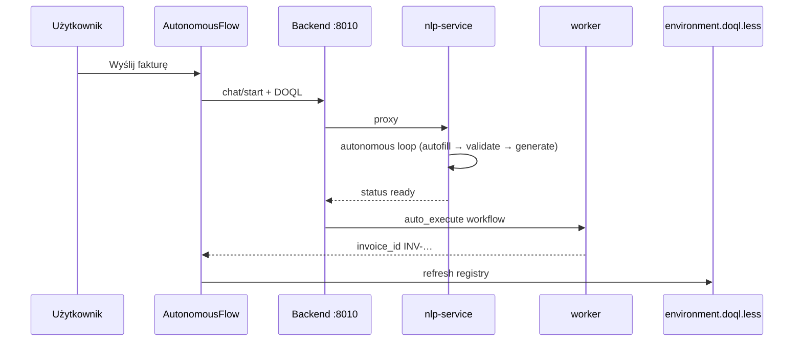

# Przykład 01 — Wysyłanie faktury

Mapa systemu: [`.nlp2dsl/registry/environment.doql.less`](.nlp2dsl/registry/environment.doql.less)

```
NL  →  WorkflowDSL  →  CMD  →  worker
         ↑
         └── environment.doql.less (runtimes, commands, data, conversation)
```

Logika: [`scenario.py`](scenario.py). Uruchomienie: `python3 main.py` (wymaga `docker compose up -d` z roota repo).

Powiązane: [`05-conversation-flow`](../05-conversation-flow/) (multi-turn bez załącznika), [`docs/process-agent.md`](../../docs/process-agent.md), [`docs/doql-system-map.md`](../../docs/doql-system-map.md).

---

## Tryby uruchomienia

| Zmienna | Domyślnie | Opis |
|---------|-----------|------|
| `NLP2DSL_INVOICE_MODE=conversation` | ✅ | Jedno zadanie → autofill → validate → auto_execute |
| `NLP2DSL_INVOICE_MODE=one-shot` | | Jedno zdanie z kwotą i odbiorcą → execute |
| `NLP2DSL_INVOICE_MODE=attachment` | | Wymagany załącznik PDF; opcjonalnie nested `generate_invoice` |

```bash
# konwersacja z autofill (domyślnie)
python3 main.py

# one-shot
NLP2DSL_INVOICE_MODE=one-shot python3 main.py

# załącznik wymagany
NLP2DSL_INVOICE_MODE=attachment python3 main.py
```

Po rebuildzie obrazów Docker (gdy zmieniasz kod nlp-service):

```bash
docker compose build nlp-service backend && docker compose up -d nlp-service backend
```

---

## Gdzie jest „faktura”? (brak pliku PDF)

**Domyślnie plik faktury nie jest wymagany ani tworzony.**

| Element | Wymagany? | Gdzie trafia |
|---------|-----------|--------------|
| `amount`, `to` | tak | DSL → worker |
| `attachment_path` | nie (domyślnie `""`) | opcjonalny w registry |
| Wynik worker | — | `invoice_id: INV-{timestamp}` w JSON odpowiedzi |
| Plik PDF | nie | **brak** w `.nlp2dsl/` |

Worker (`send_invoice`) to **symulacja MVP**: log + ID, bez zapisu PDF i bez wysyłki e-mail.

### Walidacja pliku PDF / załącznika

Walidacja uruchamia się **gdy `attachment_path` jest niepusty** w DSL (np. z autofill artefaktu `fixtures/faktura-2024.pdf`).

| Tryb | Co sprawdzamy |
|------|----------------|
| **Domyślny MVP** | plik istnieje (ścieżka rozwiązywana przez `NLP2DSL_EXAMPLE_DIR`) **oraz** nagłówek `%PDF` **lub** tekst `FAKTURA` + zgodność kwoty |
| **`NLP2DSL_STRICT_PDF=1`** | wymagany binarny PDF (`%PDF-`) — odrzuca pliki tekstowe MVP |

Dlaczego w `reflect-*.json` widzisz `"ready": true` bez błędów?

1. `fixtures/faktura-2024.pdf` to **tekst MVP** z nagłówkiem `FAKTURA` — w trybie domyślnym **przechodzi** walidację.
2. Reflection po stronie klienta (SDK) używa tej samej logiki co nlp-service.
3. W **Dockerze** nlp-service/backend muszą widzieć fixtures — mount `./examples:/examples:ro` + `NLP2DSL_EXAMPLES_MOUNT=/examples` (ustawiane automatycznie w `examples/bootstrap.py` przy backend `:8010`).

```bash
# wymuś odrzucenie tekstowego „PDF”
NLP2DSL_STRICT_PDF=1 python3 main.py
```

Po rebuild `nlp-service` DSL powinien zawierać **absolutną** ścieżkę załącznika (normalizacja w `build_and_check_dsl`).

### Gdy w DOQL jest `conversation.attachment_required: true`

1. Brak pliku → `incomplete`, pytanie o PDF **albo**
2. Przy `generate_invoice_if_missing: true` → nested `generate_invoice` tworzy plik tekstowy w `/tmp/nlp2dsl-invoices/` (w kontenerze worker/nlp-service), ścieżka trafia do `attachment_path`.

Szczegóły: sekcja *Załącznik* w [`docs/artifacts.md`](../../docs/artifacts.md).

---

## Przepływ conversation (domyślny — autonomiczny)

Jedno zadanie (`Wyślij fakturę`) — system sam uzupełnia dane, generuje brakujące pliki i wykonuje workflow:

```bash
python3 main.py
# NLP2DSL_AUTO_EXECUTE=1 (domyślnie) → status executed w jednej turze
NLP2DSL_AUTO_EXECUTE=0 python3 main.py   # tylko ready, bez worker
NLP2DSL_INVOICE_MODE=attachment python3 main.py
```



Pierwsza tura może od razu zwrócić `ready`, jeśli `data { send_invoice.amount; send_invoice.to; }` jest w DOQL.

---

## Artefakty `.nlp2dsl/`

Katalog jest **generowany** przy `main.py` (pusty przed pierwszym runem jest OK).

| Plik | Rola | Uwagi |
|------|------|--------|
| **`registry/environment.doql.less`** | **Live registry** | Odświeżany po każdej turze |
| `runs/{id}/turn-*.json` | Snapshot per prompt | `ConversationFlow` |
| `runs/{id}/reflect-*.json` | **Refleksja** target vs current | `ConversationFlow(reflect=True)` |
| `report/last-run.result.json` | Raport TestQL | CI |
| `manifest.yaml` | Indeks zapytań → ścieżki pipeline | Pochodny |
| `pipeline/*.json` | Pełna odpowiedź API (DSL + execution) | Tu jest `invoice_id` |
| `process/*.process.yaml` | Warstwy nlp → dsl → cmd → process | Debug |
| `commands.testql.toon.yaml` | Scenariusz TestQL CLI | Walidacja |
| `conversation.testql.toon.yaml` | Scenariusz chat (generowany) | Walidacja strukturalna |
| `result.json` | Raport checków TestQL | Opcjonalny raport CI |
| `services.yaml` | Snapshot akcji z API | Duplikat fragmentu DOQL |

**Nie trzymaj ręcznie** duplikatów stanu — po clean run wystarczy odtworzyć przez `python3 main.py`.

### `workflow_history` po wykonaniu

```less
workflow_history {
  last_phase: "executed";
  last_invoice_id: "INV-20260605181715";
  last_status: "completed";
  count: 5;
  recent_ids: "...";
}
```

---

## Czyszczenie przed kolejnym runem

```bash
rm -rf .nlp2dsl/*
python3 main.py
```

Statyczne fixtures są w `examples/01-invoice/fixtures/` (poza `.nlp2dsl`).

---

## Walidacja

```bash
# z roota repo nlp2dsl
docker compose up -d
cd examples/01-invoice && python3 main.py

# testy jednostkowe
./run-all-tests.sh

# raport TestQL per przykład
python3 scripts/run-example-testql-results.py 01-invoice
```

Oczekiwany wynik conversation (autonomiczny): jedna tura → `🎉 Faktura wysłana! ID: INV-…` (bez ręcznego `uruchom` gdy `NLP2DSL_AUTO_EXECUTE=1`).

---

## Zaimplementowane vs planowane

| Aspekt | Stan |
|--------|------|
| SystemMapIR → DOQL (`runtimes[]`, `commands[]`) | ✅ |
| ProcessAgent preflight + autofill | ✅ |
| Registry refresh (`last_invoice_id`, `last_phase`) | ✅ |
| **ReflectionReport** po każdej decyzji (`reflect-*.json`) | ✅ |
| Conversation bez pliku PDF | ✅ (MVP) |
| Nested `generate_invoice` gdy `attachment_required` | ✅ |
| Walidacja pól + formatu przed `ready` / przed krokiem worker | ✅ |
| Walidacja kwoty w pliku vs request (MVP tekst/PDF) | ✅ |
| Post-exec TestQL `VALIDATE file/email` | ❌ planowane |
| Idempotencja / deduplikacja faktur | ❌ planowane |

Pełna mapa implementacji: [`docs/process-agent.md`](../../docs/process-agent.md).
