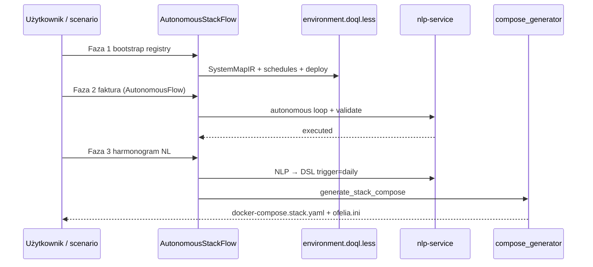

# Przykład 13 — Autonomiczny stack faktur (compose + cron)

Rozszerza [`01-invoice`](../01-invoice/) i [`04-scheduled-report`](../04-scheduled-report/) o:

- **Multi-turn** polecenia z pętlą walidacji i refleksją (`ReflectionReport`)
- **Autonomiczne** uzupełnianie z `environment.doql.less` (autofill, fixtures, `generate_invoice`)
- **Generowanie artefaktów** docker-compose + cron (Ofelia) pod `.nlp2dsl/generated/`
- **Nowe usługi** (stub runner) gdy brakuje sidecar do harmonogramu

Mapa systemu: [`.nlp2dsl/registry/environment.doql.less`](.nlp2dsl/registry/environment.doql.less)

---

## Uruchomienie

```bash
# z roota repo nlp2dsl
docker compose up -d --build backend nlp-service worker

cd examples/13-autonomous-invoice-stack
python3 main.py
```

Tryby:

| Zmienna | Opis |
|---------|------|
| `NLP2DSL_STACK_MODE=full` | bootstrap + faktura + harmonogram + compose (domyślnie) |
| `NLP2DSL_STACK_MODE=invoice-only` | tylko bootstrap + autonomiczna faktura |
| `NLP2DSL_STACK_MODE=no-attachment` | bez wymaganego załącznika PDF |

---

## Fazy procesu



| Faza | Prompt | SDK |
|------|--------|-----|
| bootstrap | (registry) | `ensure_doql_registry` + `generate_system_map` |
| invoice_autonomous | Wyślij fakturę… załącznik PDF | `AutonomousFlow` |
| schedule_validate | Codziennie o 9:00 raport… | `execute_from_text` |
| compose_generate | (auto) | `compose_generator.generate_stack_compose` |

---

## Wygenerowane artefakty

```
.nlp2dsl/generated/
├── docker-compose.stack.yaml   # cron sidecar + generated services
├── ofelia.ini                  # harmonogram cron
├── run-scheduled-task.sh       # dispatch do backend /workflow/run
├── stack.manifest.yaml         # indeks + komendy walidacji
└── services/invoice-stack-runner/
    ├── Dockerfile
    └── run-task.sh
```

### Transparentne uruchomienie stacku

Po `main.py` manifest zawiera `up_command`, np.:

```bash
docker compose -f docker-compose.yml -f examples/docker-compose.yml \
  -f examples/13-autonomous-invoice-stack/.nlp2dsl/generated/docker-compose.stack.yaml \
  --profile invoice,email,scheduled,autonomous-stack up -d
```

Cron (Ofelia) w kontenerze `invoice-stack-cron` wywołuje `run-scheduled-task.sh` według `schedules[].cron` z DOQL.

---

## Walidacja

```bash
# z roota repo
python3 -m pytest tests/test_compose_generator.py -q

cd examples/13-autonomous-invoice-stack && python3 main.py
test -f .nlp2dsl/generated/docker-compose.stack.yaml
grep -q invoice-stack-cron .nlp2dsl/generated/docker-compose.stack.yaml
```

---

## Powiązane

- [`docs/autonomous-stack.md`](../../docs/autonomous-stack.md) — architektura generatora
- [`docs/reflection-model.md`](../../docs/reflection-model.md) — ReflectionReport
- [`01-invoice`](../01-invoice/) — autonomiczna faktura MVP
- [`04-scheduled-report`](../04-scheduled-report/) — trigger daily/weekly w DSL
