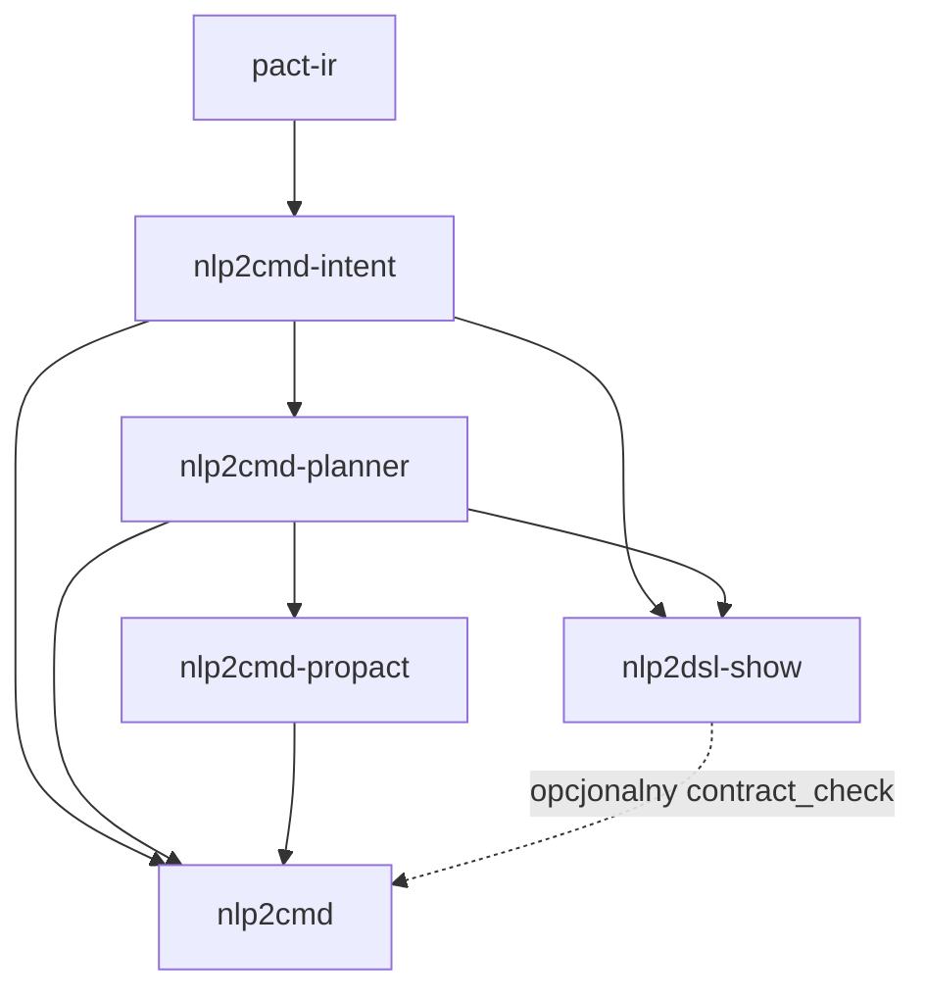
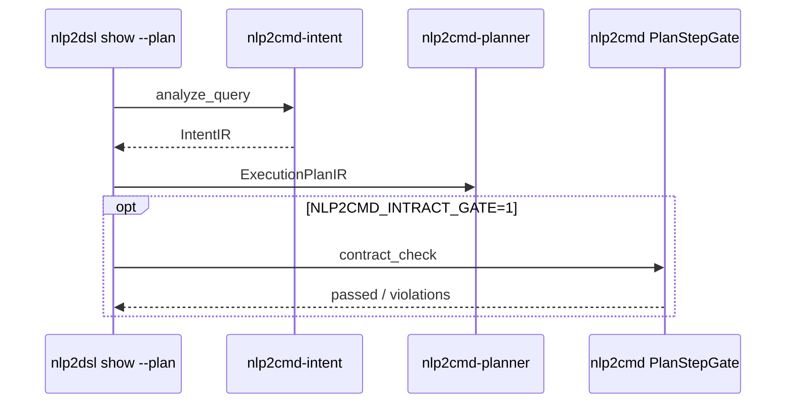

# NLP2DSL integration packages

Wspólne pakiety dla integracji **nlp2cmd** (NL → plan → wykonanie) z **Propact** (pact → wykonanie).

| Pakiet | Import / CLI | Rola |
|--------|--------------|------|
| `pact-ir` | `pact_ir` | Wspólne `IntentIR` i `ExecutionPlanIR` |
| `nlp2cmd-intent` | `nlp2cmd_intent` | Normalizacja, intencja, keyword detector (kanoniczny) |
| `nlp2cmd-planner` | `nlp2cmd_planner` | Strategie planowania → `ExecutionPlanIR` |
| `nlp2cmd-propact` | `nlp2cmd_propact` | IR → Propact markdown + `HybridPlanExecutor` |
| `nlp2dsl-show` | **`nlp2dsl-show`** | Tylko struktura zapytania — bez wykonania |

## Podział odpowiedzialności

| Narzędzie | Zadanie |
|-----------|---------|
| **`nlp2dsl show "query"`** | Struktura zapytania (IntentIR) — SDK CLI, **bez wykonania** |
| **`nlp2dsl-show show "query"`** | To samo (pakiet `nlp2dsl-show`, bez backendu) |
| **`nlp2cmd plan "query"`** | Plan → Propact markdown; `--execute` uruchamia hybrid executor |
| **`nlp2cmd -q "query" -r`** | Legacy runtime (shell / browser / canvas) |
| **`nlp2cmd -q "query" --explain`** | Analiza wejścia (IntentIR) + generowanie |

`nlp2cmd` domyślnie uruchamia analizę nlp2dsl na wejściu (`NLP2CMD_QUERY_INPUT=1`).

`nlp2dsl-run` jest **deprecated** — użyj `nlp2cmd plan`.

## Routing wykonania (`HybridPlanExecutor`)

`nlp2cmd plan --execute` kieruje kroki planu według `target_kind`:

| `target_kind` | Executor | Propact block |
|---------------|----------|---------------|
| `shell` | Propact (lub shell fallback) | ` ```propact:shell` ` |
| `rest`, `mcp`, `ws` | Propact | ` ```propact:rest` ` / `mcp` / `ws` |
| `browser`, `sql`, `desktop` | nlp2cmd `PipelineRunner` | ` ```propact:delegate` ` (marker w MD) |

Podgląd tras: `nlp2cmd plan "…" --explain` lub `--json` (pole `execution_routes`).

## Instalacja (dev)

```bash
cd /path/to/nlp2dsl
./scripts/setup-dev.sh

export NLP2CMD_INTEGRATION=1
```

## Przykłady

```bash
# Struktura (bez wykonania)
nlp2dsl show "znajdz pliki *.py w src"
nlp2dsl show "znajdz pliki *.py w src" --plan

# Plan + markdown
NLP2CMD_INTEGRATION=1 nlp2cmd plan "znajdz pliki *.py w src"
nlp2cmd plan "znajdz pliki *.py w src" --explain
nlp2cmd plan "znajdz pliki *.py w src" --json

# Wykonanie (shell → Propact lub subprocess fallback)
nlp2cmd plan "znajdz pliki *.py w src" --execute

# Workflow REST (wymaga backendu nlp2dsl)
export NLP2CMD_NLP2DSL_WORKFLOW=1 NLP2DSL_BACKEND_URL=http://127.0.0.1:8010
nlp2cmd plan "Wyslij fakture na 1500 PLN do a@b.pl" --json

# Legacy runtime + analiza wejścia
NLP2CMD_SHOW_STRUCTURE=1 nlp2cmd -q "znajdz pliki *.py w src" --explain
```

## Kolejność zależności



Browser/desktop/canvas automation pozostaje w legacy runtime **nlp2cmd** (delegacja z hybrid executora).

## Walidacja i Intract

| Warstwa | Pakiet / narzędzie | Intract? |
|---------|-------------------|----------|
| Struktura IR | `pact-ir`, Pydantic | nie |
| Detekcja intencji | `nlp2cmd-intent` | nie |
| Planowanie | `nlp2cmd-planner` | nie |
| Kontrakty planu | `nlp2cmd` + `NLP2CMD_INTRACT_GATE` | tak (`PlanStepGate`) |
| Wykonanie legacy | `nlp2cmd -q -r` | tak (`TransformValidator`, `PipelineRunnerGate`) |



Szczegóły: [`../docs/intract-integration.md`](../docs/intract-integration.md) · pełna architektura runtime: [nlp2cmd/docs/architecture/intract-integration.md](https://github.com/wronai/nlp2cmd/blob/main/docs/architecture/intract-integration.md)

## Zmienne środowiskowe

| Zmienna | Domyślnie | Opis |
|---------|-----------|------|
| `NLP2CMD_INTEGRATION` | `0` | Włącza `nlp2cmd plan` |
| `NLP2CMD_QUERY_INPUT` | `1` | IntentIR na wejściu każdego zapytania |
| `NLP2CMD_SHOW_STRUCTURE` | `0` | Zawsze pokaż analizę tekstu |
| `NLP2CMD_NLP2DSL_WORKFLOW` | `0` | Planner REST: `/workflow/from-text` (faktury, e-mail) |
| `NLP2DSL_BACKEND_URL` | `http://localhost:8010` | Backend nlp2dsl dla workflow |
| `NLP2DSL_TIMEOUT` | `10` | Timeout HTTP workflow (s) |
| `NLP2CMD_PROPACT_BIN` | `propact` | Ścieżka do CLI Propact |
| `NLP2CMD_PROPACT_FALLBACK` | `shell` | Gdy brak propact: `shell` = subprocess; `error` = błąd |
| `NLP2CMD_INTRACT_GATE` | `0` | `contract_check` w `show --plan`; gate w `nlp2cmd plan` i legacy runtime |
| `NLP2CMD_ENFORCE_CLARIFICATION` | `0` | `show` blokuje `confidence < 0.5` (`plan` — zawsze) |
| `NLP2CMD_POST_CHECK` | `0` | Po `plan --execute`: walidacja stdout (nlp2cmd) |
| `NLP2DSL_UTF8` | `1` | Auto UTF-8 w CLI/SDK (`0` = wyłącz) |

## Publikacja (PyPI)

```bash
make build-all    # root SDK + wszystkie pakiety
make publish      # twine upload wszystkiego
```
