# System Architecture Analysis
<!-- generated in 0.00s -->

## Overview

- **Project**: /home/tom/github/wronai/nlp2dsl
- **Primary Language**: python
- **Languages**: python: 145, json: 15, shell: 11, toml: 10, yaml: 9
- **Analysis Mode**: static
- **Total Functions**: 605
- **Total Classes**: 83
- **Modules**: 210
- **Entry Points**: 333

## Architecture by Module

### nlp2dsl_sdk.client
- **Functions**: 51
- **Classes**: 2
- **File**: `client.py`

### nlp-service.app.routing.parser.rules
- **Functions**: 31
- **File**: `rules.py`

### nlp-service.app.main
- **Functions**: 24
- **File**: `main.py`

### packages.nlp2cmd-intent.src.nlp2cmd_intent.keywords.keyword_detector
- **Functions**: 22
- **Classes**: 2
- **File**: `keyword_detector.py`

### tauri-wrapper.scripts.serve-dist
- **Functions**: 21
- **File**: `serve-dist.js`

### nlp-service.app.conversation.responses
- **Functions**: 19
- **File**: `responses.py`

### nlp2dsl_sdk.artifacts
- **Functions**: 17
- **Classes**: 1
- **File**: `artifacts.py`

### packages.nlp2cmd-intent.src.nlp2cmd_intent.keywords.keyword_patterns
- **Functions**: 15
- **Classes**: 1
- **File**: `keyword_patterns.py`

### nlp-service.app.governance.policy
- **Functions**: 14
- **Classes**: 2
- **File**: `policy.py`

### nlp-service.app.system_executor
- **Functions**: 13
- **File**: `system_executor.py`

### nlp-service.app.governance.config
- **Functions**: 13
- **Classes**: 1
- **File**: `config.py`

### nlp-service.app.routing.native
- **Functions**: 13
- **File**: `native.py`

### worker.worker
- **Functions**: 12
- **File**: `worker.py`

### backend.app.db.postgres
- **Functions**: 11
- **Classes**: 3
- **File**: `postgres.py`

### packages.nlp2cmd-propact.src.nlp2cmd_propact.runner
- **Functions**: 11
- **Classes**: 2
- **File**: `runner.py`

### nlp2dsl_sdk.demos
- **Functions**: 11
- **Classes**: 1
- **File**: `demos.py`

### nlp-service.app.settings
- **Functions**: 11
- **Classes**: 6
- **File**: `settings.py`

### nlp-service.app.routing.orientation
- **Functions**: 11
- **Classes**: 1
- **File**: `orientation.py`

### scripts.run-example-testql-results
- **Functions**: 11
- **Classes**: 2
- **File**: `run-example-testql-results.py`

### backend.app.routers.workflow
- **Functions**: 10
- **File**: `workflow.py`

## Key Entry Points

Main execution flows into the system:

### packages.nlp2cmd-intent.src.nlp2cmd_intent.keywords.keyword_detector.KeywordIntentDetector._fast_path_detection
> Fast path detection for common patterns.
- **Calls**: None.join, text_lower.strip, _SQL_EXACT.items, any, _SHELL_TERMS.items, re.search, re.search, re.search

### packages.nlp2cmd-intent.src.nlp2cmd_intent.keywords.keyword_patterns.KeywordPatterns._load_detector_config_from_json
> Load detector configuration from JSON files.
- **Calls**: packages.nlp2cmd-intent.src.nlp2cmd_intent.keywords.keyword_patterns._find_data_files, os.environ.get, payload.get, isinstance, payload.get, isinstance, payload.get, isinstance

### scripts.run-example-testql-results.main
- **Calls**: nlp-service.app.settings.SettingsManager.set, sorted, out.write_text, print, EXAMPLES.iterdir, print, None.isoformat, len

### backend.app.routers.workflow.workflow_from_text
> Pełny pipeline: tekst → NLP → DSL → (opcjonalne) wykonanie.

Body: {"text": "...", "mode": "auto|rules|llm", "execute": true|false}
- **Calls**: router.post, body.get, body.get, body.get, nlp_resp.json, text.strip, HTTPException, AsyncClient

### packages.nlp2cmd-intent.src.nlp2cmd_intent.keywords.keyword_patterns.KeywordPatterns._load_patterns_from_json
> Load patterns from external JSON file.
- **Calls**: packages.nlp2cmd-intent.src.nlp2cmd_intent.keywords.keyword_patterns._find_data_files, pattern_files.append, pattern_files.append, Path, os.environ.get, payload.items, logger.debug, open

### nlp2dsl_sdk.cli.main
- **Calls**: nlp2dsl_sdk.encoding.configure_utf8, argparse.ArgumentParser, parser.add_subparsers, sub.add_parser, show_parser.add_argument, show_parser.add_argument, sub.add_parser, run_parser.add_argument

### examples.12-ir-show.scenario.run
- **Calls**: print, nlp2dsl_sdk.artifacts.get_example_writer, nlp2dsl_sdk.preview.ensure_services, print, NLP2DSLClient.from_env, print, print, print

### nlp-service.app.main.websocket_chat
> WebSocket endpoint dla voice chat w czasie rzeczywistym.

Flow:
1. Klient łączy się przez WebSocket
2. Wysyła audio chunks (binary)
3. Server streamuj
- **Calls**: app.websocket, log.info, websocket.accept, nlp-service.app.audio_parser.is_stt_available, StreamingSTT, log.info, log.info, log.exception

### backend.app.routers.workflow.stream_workflow
> SSE stream with live workflow lifecycle events.
- **Calls**: router.get, StreamingResponse, _repo.get_run, HTTPException, backend.app.routers.workflow._workflow_snapshot, event_generator, backend.app.routers.workflow._format_sse, snapshot.get

### examples.09-execution-smoke.scenario.run
- **Calls**: print, sum, print, NLP2DSLClient.from_env, nlp2dsl_sdk.preview.ensure_services, print, client.workflow_from_text, preview.get

### examples.01-invoice.scenario.run
- **Calls**: print, nlp2dsl_sdk.preview.preview_text_examples, nlp2dsl_sdk.preview.execute_from_text, nlp2dsl_sdk.artifacts.get_example_writer, NLP2DSLClient.from_env, nlp2dsl_sdk.preview.ensure_services, result.get, result.get

### backend.app.routers.chat.chat_message
> Kontynuuj konwersację — uzupełnij brakujące dane.

Body: {"conversation_id": "abc", "text": "klient@firma.pl"}
- **Calls**: router.post, resp.json, None.lower, backend.app.routers.chat._proxy_chat_payload, HTTPException, any, result.get, body.get

### packages.nlp2cmd-intent.src.nlp2cmd_intent.keywords.keyword_detector.KeywordIntentDetector.detect
> Detect domain and intent from text.

Args:
    text: Input text to analyze
    
Returns:
    DetectionResult with detected domain, intent, and confide
- **Calls**: packages.nlp2cmd-intent.src.nlp2cmd_intent.keywords.keyword_detector._get_query_normalizer, text.lower, self._ml_detection, self._fuzzy_detection, bool, self._fast_path_detection, self._semantic_detection, self._keyword_detection

### examples.04-scheduled-report.scenario.run
- **Calls**: print, print, nlp2dsl_sdk.preview.preview_text_examples, print, sum, print, print, print

### packages.nlp2cmd-intent.src.nlp2cmd_intent.keywords.keyword_detector.KeywordIntentDetector._keyword_detection
> Traditional keyword-based detection.
- **Calls**: DetectionResult, self.patterns.list_domains, self.patterns.get_priority_intents, self.patterns.list_domains, self.patterns.get_domain_boosters, self._calculate_keyword_confidence, any, self.patterns.get_intent_patterns

### packages.nlp2cmd-propact.src.nlp2cmd_propact.executor.HybridPlanExecutor.run
- **Calls**: self.propact_runner.render, RunResult, RunResult, RunResult, packages.nlp2cmd-propact.src.nlp2cmd_propact.executor.execution_route, step_results.append, self._run_propact_step, self._run_nlp2cmd_step

### examples.02-email.scenario.run
- **Calls**: print, nlp2dsl_sdk.preview.preview_text_examples, nlp2dsl_sdk.preview.execute_from_text, nlp2dsl_sdk.artifacts.get_example_writer, NLP2DSLClient.from_env, nlp2dsl_sdk.preview.ensure_services, result.get, result.get

### nlp-service.app.routing.parser.prompt_catalog.build_llm_system_prompt
> Schemat intencji i pól generowany z rejestru (nie hardcoded).
- **Calls**: sorted, sorted, ACTIONS_REGISTRY.items, actions_lines.append, None.join, None.join, None.join, sorted

### nlp-service.app.system_executor._exec_file_read
- **Calls**: config.get, nlp-service.app.system_executor._validate_file_path, None.read_text, config.get, config.get, None.exists, None.is_file, content.split

### packages.nlp2cmd-intent.src.nlp2cmd_intent.data_files.find_data_files
- **Calls**: nlp-service.app.settings.SettingsManager.set, packages.nlp2cmd-intent.src.nlp2cmd_intent.data_files._package_data_dir, packages.nlp2cmd-intent.src.nlp2cmd_intent.data_files._nlp2cmd_data_dir, add, add, add, add, add

### packages.nlp2dsl-show.src.nlp2dsl_show.cli.main
- **Calls**: nlp2dsl_sdk.encoding.configure_utf8, argparse.ArgumentParser, parser.add_subparsers, sub.add_parser, show.add_argument, show.add_argument, show.add_argument, parser.parse_args

### nlp2dsl_sdk.client.ConversationFlow._handle_in_progress_response
> Handle in_progress status response.
- **Calls**: print, data.get, data.get, print, form.get, print, print, print

### examples.11-notify-quality.scenario.run
- **Calls**: print, os.getenv, print, print, nlp2dsl_sdk.preview.preview_text_examples, print, nlp2dsl_sdk.preview.execute_text_examples, sum

### nlp-service.app.system_executor._exec_file_list
- **Calls**: config.get, config.get, sorted, candidate.exists, Path, resolved.rglob, str, len

### worker.worker.handle_generate_code
- **Calls**: worker.worker.action, config.get, config.get, config.get, config.get, ValueError, httpx.AsyncClient, response.raise_for_status

### nlp2dsl_sdk.demos.run_action_catalog_demo
- **Calls**: print, client.workflow_actions, print, NLP2DSLClient.from_env, nlp2dsl_sdk.preview.ensure_services, action.get, print, client.workflow_action_schema

### examples.03-report-and-notify.scenario.run
- **Calls**: print, nlp2dsl_sdk.preview.preview_text_examples, nlp2dsl_sdk.preview.execute_from_text, nlp2dsl_sdk.artifacts.get_example_writer, NLP2DSLClient.from_env, nlp2dsl_sdk.preview.ensure_services, result.get, result.get

### scripts.aggregate-example-testql.main
- **Calls**: sorted, OUT.parent.mkdir, OUT.write_text, print, ROOT.glob, path.read_text, parts.append, body.splitlines

### packages.nlp2cmd-intent.src.nlp2cmd_intent.keywords.keyword_detector.KeywordIntentDetector._tokenize_text
> Tokenize text using available tools.
- **Calls**: packages.nlp2cmd-intent.src.nlp2cmd_intent.keywords.keyword_detector._get_spacy_model, re.findall, text.lower, nlp, packages.nlp2cmd-intent.src.nlp2cmd_intent.keywords.keyword_detector._get_polish_support, logger.debug, hasattr, polish_support._is_important_token

### examples.08-multi-object-benchmark.scenario.run
- **Calls**: print, nlp2dsl_sdk.artifacts.get_example_writer, RESULTS_DIR.mkdir, out.write_text, print, NLP2DSLClient.from_env, nlp2dsl_sdk.preview.ensure_services, print

## Process Flows

Key execution flows identified:

### Flow 1: _fast_path_detection
```
_fast_path_detection [packages.nlp2cmd-intent.src.nlp2cmd_intent.keywords.keyword_detector.KeywordIntentDetector]
```

### Flow 2: _load_detector_config_from_json
```
_load_detector_config_from_json [packages.nlp2cmd-intent.src.nlp2cmd_intent.keywords.keyword_patterns.KeywordPatterns]
  └─ →> _find_data_files
```

### Flow 3: main
```
main [scripts.run-example-testql-results]
  └─ →> set
```

### Flow 4: workflow_from_text
```
workflow_from_text [backend.app.routers.workflow]
```

### Flow 5: _load_patterns_from_json
```
_load_patterns_from_json [packages.nlp2cmd-intent.src.nlp2cmd_intent.keywords.keyword_patterns.KeywordPatterns]
  └─ →> _find_data_files
```

### Flow 6: run
```
run [examples.12-ir-show.scenario]
  └─ →> get_example_writer
  └─ →> ensure_services
```

### Flow 7: websocket_chat
```
websocket_chat [nlp-service.app.main]
  └─ →> is_stt_available
```

### Flow 8: stream_workflow
```
stream_workflow [backend.app.routers.workflow]
  └─> _workflow_snapshot
```

### Flow 9: chat_message
```
chat_message [backend.app.routers.chat]
  └─> _proxy_chat_payload
```

### Flow 10: detect
```
detect [packages.nlp2cmd-intent.src.nlp2cmd_intent.keywords.keyword_detector.KeywordIntentDetector]
  └─ →> _get_query_normalizer
```

## Key Classes

### nlp2dsl_sdk.client.NLP2DSLClient
> Small reusable SDK for the NLP2DSL services.
- **Methods**: 40
- **Key Methods**: nlp2dsl_sdk.client.NLP2DSLClient.__init__, nlp2dsl_sdk.client.NLP2DSLClient.from_env, nlp2dsl_sdk.client.NLP2DSLClient.close, nlp2dsl_sdk.client.NLP2DSLClient.__enter__, nlp2dsl_sdk.client.NLP2DSLClient.__exit__, nlp2dsl_sdk.client.NLP2DSLClient._request, nlp2dsl_sdk.client.NLP2DSLClient._backend, nlp2dsl_sdk.client.NLP2DSLClient._nlp_service, nlp2dsl_sdk.client.NLP2DSLClient._worker, nlp2dsl_sdk.client.NLP2DSLClient.backend_health

### packages.nlp2cmd-intent.src.nlp2cmd_intent.keywords.keyword_detector.KeywordIntentDetector
> Rule-based intent detection using keyword matching.

No LLM needed - uses predefined keyword pattern
- **Methods**: 14
- **Key Methods**: packages.nlp2cmd-intent.src.nlp2cmd_intent.keywords.keyword_detector.KeywordIntentDetector.__init__, packages.nlp2cmd-intent.src.nlp2cmd_intent.keywords.keyword_detector.KeywordIntentDetector.add_pattern, packages.nlp2cmd-intent.src.nlp2cmd_intent.keywords.keyword_detector.KeywordIntentDetector.detect, packages.nlp2cmd-intent.src.nlp2cmd_intent.keywords.keyword_detector.KeywordIntentDetector.detect_intent_ir, packages.nlp2cmd-intent.src.nlp2cmd_intent.keywords.keyword_detector.KeywordIntentDetector.detect_all, packages.nlp2cmd-intent.src.nlp2cmd_intent.keywords.keyword_detector.KeywordIntentDetector._match_keyword, packages.nlp2cmd-intent.src.nlp2cmd_intent.keywords.keyword_detector.KeywordIntentDetector._fast_path_detection, packages.nlp2cmd-intent.src.nlp2cmd_intent.keywords.keyword_detector.KeywordIntentDetector._fuzzy_detection, packages.nlp2cmd-intent.src.nlp2cmd_intent.keywords.keyword_detector.KeywordIntentDetector._ml_detection, packages.nlp2cmd-intent.src.nlp2cmd_intent.keywords.keyword_detector.KeywordIntentDetector._semantic_detection

### packages.nlp2cmd-intent.src.nlp2cmd_intent.keywords.keyword_patterns.KeywordPatterns
> Manages keyword patterns for intent detection.
- **Methods**: 12
- **Key Methods**: packages.nlp2cmd-intent.src.nlp2cmd_intent.keywords.keyword_patterns.KeywordPatterns.__init__, packages.nlp2cmd-intent.src.nlp2cmd_intent.keywords.keyword_patterns.KeywordPatterns._load_patterns_from_json, packages.nlp2cmd-intent.src.nlp2cmd_intent.keywords.keyword_patterns.KeywordPatterns._load_detector_config_from_json, packages.nlp2cmd-intent.src.nlp2cmd_intent.keywords.keyword_patterns.KeywordPatterns.get_domain_patterns, packages.nlp2cmd-intent.src.nlp2cmd_intent.keywords.keyword_patterns.KeywordPatterns.get_intent_patterns, packages.nlp2cmd-intent.src.nlp2cmd_intent.keywords.keyword_patterns.KeywordPatterns.has_domain, packages.nlp2cmd-intent.src.nlp2cmd_intent.keywords.keyword_patterns.KeywordPatterns.has_intent, packages.nlp2cmd-intent.src.nlp2cmd_intent.keywords.keyword_patterns.KeywordPatterns.list_domains, packages.nlp2cmd-intent.src.nlp2cmd_intent.keywords.keyword_patterns.KeywordPatterns.list_intents, packages.nlp2cmd-intent.src.nlp2cmd_intent.keywords.keyword_patterns.KeywordPatterns.add_pattern

### nlp-service.app.settings.SettingsManager
> Runtime settings z persystencją do JSON.
- **Methods**: 11
- **Key Methods**: nlp-service.app.settings.SettingsManager.__new__, nlp-service.app.settings.SettingsManager.settings, nlp-service.app.settings.SettingsManager.get, nlp-service.app.settings.SettingsManager.get_section, nlp-service.app.settings.SettingsManager.get_all, nlp-service.app.settings.SettingsManager.set, nlp-service.app.settings.SettingsManager.update_section, nlp-service.app.settings.SettingsManager.reset, nlp-service.app.settings.SettingsManager._load, nlp-service.app.settings.SettingsManager._save

### backend.app.db.postgres.PostgresWorkflowRepo
- **Methods**: 10
- **Key Methods**: backend.app.db.postgres.PostgresWorkflowRepo.__init__, backend.app.db.postgres.PostgresWorkflowRepo._ensure_engine, backend.app.db.postgres.PostgresWorkflowRepo._get_session_factory, backend.app.db.postgres.PostgresWorkflowRepo._ensure_tables, backend.app.db.postgres.PostgresWorkflowRepo.save_run, backend.app.db.postgres.PostgresWorkflowRepo.update_run_status, backend.app.db.postgres.PostgresWorkflowRepo.get_run, backend.app.db.postgres.PostgresWorkflowRepo.list_runs, backend.app.db.postgres.PostgresWorkflowRepo.count_runs, backend.app.db.postgres.PostgresWorkflowRepo.close
- **Inherits**: WorkflowRepo

### nlp2dsl_sdk.client.ConversationFlow
> Convenience helper for the conversational workflow example.
- **Methods**: 10
- **Key Methods**: nlp2dsl_sdk.client.ConversationFlow.__init__, nlp2dsl_sdk.client.ConversationFlow.start, nlp2dsl_sdk.client.ConversationFlow.send_message, nlp2dsl_sdk.client.ConversationFlow._handle_response, nlp2dsl_sdk.client.ConversationFlow._handle_in_progress_response, nlp2dsl_sdk.client.ConversationFlow._handle_ready_response, nlp2dsl_sdk.client.ConversationFlow._handle_completed_response, nlp2dsl_sdk.client.ConversationFlow._handle_error_response, nlp2dsl_sdk.client.ConversationFlow.run_demo, nlp2dsl_sdk.client.ConversationFlow.run_interactive

### nlp-service.app.code_generator.CodeGenerator
> Generates code in multiple programming languages using LLM.
- **Methods**: 8
- **Key Methods**: nlp-service.app.code_generator.CodeGenerator.__init__, nlp-service.app.code_generator.CodeGenerator._get_api_key, nlp-service.app.code_generator.CodeGenerator._build_prompt, nlp-service.app.code_generator.CodeGenerator.generate_code, nlp-service.app.code_generator.CodeGenerator._extract_class_name, nlp-service.app.code_generator.CodeGenerator._split_code_and_tests, nlp-service.app.code_generator.CodeGenerator.get_supported_languages, nlp-service.app.code_generator.CodeGenerator.get_language_info

### nlp-service.app.store.redis_store.RedisConversationStore
- **Methods**: 7
- **Key Methods**: nlp-service.app.store.redis_store.RedisConversationStore.__init__, nlp-service.app.store.redis_store.RedisConversationStore._key, nlp-service.app.store.redis_store.RedisConversationStore.get, nlp-service.app.store.redis_store.RedisConversationStore.save, nlp-service.app.store.redis_store.RedisConversationStore.delete, nlp-service.app.store.redis_store.RedisConversationStore.count, nlp-service.app.store.redis_store.RedisConversationStore.close
- **Inherits**: ConversationStore

### backend.app.db.memory.MemoryWorkflowRepo
- **Methods**: 6
- **Key Methods**: backend.app.db.memory.MemoryWorkflowRepo.__init__, backend.app.db.memory.MemoryWorkflowRepo.save_run, backend.app.db.memory.MemoryWorkflowRepo.update_run_status, backend.app.db.memory.MemoryWorkflowRepo.get_run, backend.app.db.memory.MemoryWorkflowRepo.list_runs, backend.app.db.memory.MemoryWorkflowRepo.count_runs
- **Inherits**: WorkflowRepo

### backend.app.workflow_events.WorkflowEventHub
> In-memory broadcaster dla workflow lifecycle events.
- **Methods**: 5
- **Key Methods**: backend.app.workflow_events.WorkflowEventHub.__init__, backend.app.workflow_events.WorkflowEventHub.subscribe, backend.app.workflow_events.WorkflowEventHub.unsubscribe, backend.app.workflow_events.WorkflowEventHub.publish, backend.app.workflow_events.WorkflowEventHub.subscriber_count

### backend.app.db.WorkflowRepo
> Abstrakcja persystencji workflow.
- **Methods**: 5
- **Key Methods**: backend.app.db.WorkflowRepo.save_run, backend.app.db.WorkflowRepo.update_run_status, backend.app.db.WorkflowRepo.get_run, backend.app.db.WorkflowRepo.list_runs, backend.app.db.WorkflowRepo.count_runs
- **Inherits**: ABC

### nlp-service.app.audio_parser.StreamingSTT
> Real-time streaming STT via Deepgram WebSocket.
Placeholder - requires WebSocket implementation.
- **Methods**: 5
- **Key Methods**: nlp-service.app.audio_parser.StreamingSTT.__init__, nlp-service.app.audio_parser.StreamingSTT.start, nlp-service.app.audio_parser.StreamingSTT.send_audio, nlp-service.app.audio_parser.StreamingSTT.get_transcript, nlp-service.app.audio_parser.StreamingSTT.stop

### nlp-service.app.store.memory.MemoryConversationStore
- **Methods**: 5
- **Key Methods**: nlp-service.app.store.memory.MemoryConversationStore.__init__, nlp-service.app.store.memory.MemoryConversationStore.get, nlp-service.app.store.memory.MemoryConversationStore.save, nlp-service.app.store.memory.MemoryConversationStore.delete, nlp-service.app.store.memory.MemoryConversationStore.count
- **Inherits**: ConversationStore

### packages.nlp2cmd-propact.src.nlp2cmd_propact.runner.PropactRunner
> Run ExecutionPlanIR through Propact CLI when available.
- **Methods**: 4
- **Key Methods**: packages.nlp2cmd-propact.src.nlp2cmd_propact.runner.PropactRunner.__init__, packages.nlp2cmd-propact.src.nlp2cmd_propact.runner.PropactRunner.render, packages.nlp2cmd-propact.src.nlp2cmd_propact.runner.PropactRunner.run, packages.nlp2cmd-propact.src.nlp2cmd_propact.runner.PropactRunner._run_via_propact

### packages.nlp2cmd-propact.src.nlp2cmd_propact.executor.HybridPlanExecutor
> Route plan steps to Propact or nlp2cmd based on target_kind.
- **Methods**: 4
- **Key Methods**: packages.nlp2cmd-propact.src.nlp2cmd_propact.executor.HybridPlanExecutor.__init__, packages.nlp2cmd-propact.src.nlp2cmd_propact.executor.HybridPlanExecutor.run, packages.nlp2cmd-propact.src.nlp2cmd_propact.executor.HybridPlanExecutor._run_propact_step, packages.nlp2cmd-propact.src.nlp2cmd_propact.executor.HybridPlanExecutor._run_nlp2cmd_step

### nlp-service.app.store.ConversationStore
> Abstrakcja persystencji stanu konwersacji.
- **Methods**: 4
- **Key Methods**: nlp-service.app.store.ConversationStore.get, nlp-service.app.store.ConversationStore.save, nlp-service.app.store.ConversationStore.delete, nlp-service.app.store.ConversationStore.count
- **Inherits**: ABC

### packages.pact-ir.src.pact_ir.execution_plan.ExecutionPlanIR
> Standardized execution plan (nlp2cmd.execution_plan_ir.v1).
- **Methods**: 3
- **Key Methods**: packages.pact-ir.src.pact_ir.execution_plan.ExecutionPlanIR.from_intent, packages.pact-ir.src.pact_ir.execution_plan.ExecutionPlanIR.primary_target_kind, packages.pact-ir.src.pact_ir.execution_plan.ExecutionPlanIR.step_count
- **Inherits**: BaseModel

### nlp2dsl_sdk.artifacts.ExampleArtifactWriter
> Accumulates query results and flushes .nlp2dsl/ on finalize().
- **Methods**: 3
- **Key Methods**: nlp2dsl_sdk.artifacts.ExampleArtifactWriter.__init__, nlp2dsl_sdk.artifacts.ExampleArtifactWriter.record, nlp2dsl_sdk.artifacts.ExampleArtifactWriter.finalize

### backend.app.logging_setup.JSONFormatter
> Emit log records as single-line JSON objects.
- **Methods**: 2
- **Key Methods**: backend.app.logging_setup.JSONFormatter.__init__, backend.app.logging_setup.JSONFormatter.format
- **Inherits**: logging.Formatter

### backend.app.logging_setup.RequestIDMiddleware
> Generate or forward X-Request-ID for every HTTP request.

- Reads X-Request-ID from incoming headers
- **Methods**: 2
- **Key Methods**: backend.app.logging_setup.RequestIDMiddleware.__init__, backend.app.logging_setup.RequestIDMiddleware.dispatch
- **Inherits**: BaseHTTPMiddleware

## Data Transformation Functions

Key functions that process and transform data:

### backend.app.logging_setup.JSONFormatter.format
- **Output to**: json.dumps, time.strftime, _request_id.get, record.getMessage, self.formatException

### backend.app.routers.workflow._format_sse
- **Output to**: json.dumps, lines.append, lines.append, payload.splitlines, lines.append

### packages.nlp2cmd-planner.src.nlp2cmd_planner.strategies.rule_shell._parse_file_search
> Resolve path and glob from entities or query text.
- **Output to**: intent.entities.get, intent.entities.get, intent.entities.get, intent.entities.get, intent.entities.get

### packages.nlp2dsl-show.src.nlp2dsl_show.cli._serialize
- **Output to**: json.dumps, yaml.safe_dump

### packages.nlp2cmd-propact.src.nlp2cmd_propact.adapter._format_json_body
- **Output to**: isinstance, json.dumps, value.strip

### nlp2dsl_sdk.artifacts.build_process_trace
> NLP → DSL → CMD → process service layers from a workflow_from_text result.
- **Output to**: steps_out.append, steps_out.append, None.get, steps_out.append, steps_out.append

### nlp-service.app.logging_setup.JSONFormatter.format
- **Output to**: json.dumps, time.strftime, _request_id.get, record.getMessage, self.formatException

### nlp-service.app.main.parse_text
> Etap 1: tekst → intent + entities.
Nie generuje DSL — tylko rozumie język naturalny.
- **Output to**: app.post, nlp-service.app.main._run_parser

### nlp-service.app.main._run_parser
> Execute parser according to mode.
- **Output to**: HTTPException, nlp-service.app.routing.parser.resolve_mode.parse_with_mode, nlp-service.app.routing.parser.llm._detect_provider

### nlp-service.app.system_executor._validate_file_path
> Validate and resolve file path against allowed paths.
- **Output to**: str, any, None.suffix.lower, None.resolve, PermissionError

### nlp-service.app.conversation.responses.format_system_result
- **Output to**: result.get, _SYSTEM_RESULT_FORMATTERS.get, json.dumps, result.get, formatter

### nlp-service.app.conversation.responses._format_system_status
- **Output to**: inner.get, inner.get, inner.get, inner.get, inner.get

### nlp-service.app.conversation.responses._format_settings_get
- **Output to**: inner.get, json.dumps

### nlp-service.app.conversation.responses._format_settings_set
- **Output to**: inner.get, inner.get, inner.get

### nlp-service.app.conversation.responses._format_settings_reset
- **Output to**: inner.get

### nlp-service.app.conversation.responses._format_file_read
- **Output to**: inner.get, inner.get, inner.get, inner.get, inner.get

### nlp-service.app.conversation.responses._format_file_write
- **Output to**: inner.get, inner.get, inner.get

### nlp-service.app.conversation.responses._format_file_list
- **Output to**: inner.get, None.join, lines.append, inner.get, inner.get

### nlp-service.app.conversation.responses._format_registry_list
- **Output to**: inner.get, actions.items, None.join, meta.get, None.join

### nlp-service.app.conversation.responses._format_registry_update
- **Output to**: json.dumps

### nlp-service.app.conversation.orchestrator._process_message
- **Output to**: log.info, nlp-service.app.conversation.merge.merge_into_state, nlp-service.app.conversation.responses.handle_unknown_intent, nlp-service.app.conversation.responses.handle_system_action, nlp-service.app.conversation.orchestrator._attach_routing

### nlp-service.app.routing.resolve._parser_source
> Etykieta źródła parsera (rules vs llm) — zgodnie z NLP_CHAT_MODE=auto.
- **Output to**: None.strip, nlp-service.app.routing.parser.rules.parse_rules, None.lower, os.getenv

### nlp-service.app.routing.parser.facade.parse_text
> mode: rules | llm | auto
Domyślnie NLP_CHAT_MODE lub auto.
- **Output to**: None.strip, nlp-service.app.routing.parser.resolve_mode.parse_with_mode, None.lower, os.getenv

### nlp-service.app.routing.parser.llm.parse_llm
> Parse text using LLM via LiteLLM.
- **Output to**: nlp-service.app.routing.parser.llm._detect_provider, log.info, log.debug, nlp-service.app.routing.parser.llm._parse_json_response, NLPResult

### nlp-service.app.routing.parser.llm._parse_json_response
> Extract JSON from LLM response (handles markdown fences).
- **Output to**: raw.strip, cleaned.startswith, cleaned.find, json.loads, cleaned.split

## Behavioral Patterns

### recursion__merge_dict
- **Type**: recursion
- **Confidence**: 0.90
- **Functions**: nlp-service.app.governance.config._merge_dict

### state_machine_NLP2DSLClient
- **Type**: state_machine
- **Confidence**: 0.70
- **Functions**: nlp2dsl_sdk.client.NLP2DSLClient.__init__, nlp2dsl_sdk.client.NLP2DSLClient.from_env, nlp2dsl_sdk.client.NLP2DSLClient.close, nlp2dsl_sdk.client.NLP2DSLClient.__enter__, nlp2dsl_sdk.client.NLP2DSLClient.__exit__

## Public API Surface

Functions exposed as public API (no underscore prefix):

- `scripts.run-example-testql-results.process_example` - 38 calls
- `nlp-service.app.routing.resolve.resolve_intent` - 31 calls
- `scripts.run-example-testql-results.main` - 31 calls
- `nlp2dsl_sdk.artifacts.build_process_trace` - 29 calls
- `nlp-service.app.routing.parser.enrich.enrich_entities` - 29 calls
- `nlp2dsl_sdk.preview.print_workflow_preview` - 27 calls
- `nlp-service.app.routing.orientation.orient_query` - 27 calls
- `backend.app.routers.workflow.workflow_from_text` - 26 calls
- `nlp2dsl_sdk.cli.main` - 25 calls
- `examples.12-ir-show.scenario.run` - 25 calls
- `examples.08-multi-object-benchmark.scenario.run_benchmark` - 24 calls
- `nlp-service.app.main.websocket_chat` - 23 calls
- `backend.app.routers.workflow.stream_workflow` - 22 calls
- `packages.nlp2cmd-intent.src.nlp2cmd_intent.nlp2cmd_convert.detection_to_intent_ir` - 22 calls
- `examples.09-execution-smoke.scenario.run` - 22 calls
- `examples.01-invoice.scenario.run` - 22 calls
- `backend.app.routers.chat.chat_message` - 21 calls
- `packages.nlp2cmd-intent.src.nlp2cmd_intent.keywords.keyword_detector.KeywordIntentDetector.detect` - 21 calls
- `examples.04-scheduled-report.scenario.run` - 21 calls
- `packages.nlp2cmd-propact.src.nlp2cmd_propact.executor.HybridPlanExecutor.run` - 20 calls
- `nlp2dsl_sdk.artifacts.write_query_artifacts` - 19 calls
- `examples.02-email.scenario.run` - 19 calls
- `nlp-service.app.routing.parser.prompt_catalog.build_llm_system_prompt` - 19 calls
- `packages.nlp2cmd-intent.src.nlp2cmd_intent.data_files.find_data_files` - 17 calls
- `packages.nlp2dsl-show.src.nlp2dsl_show.cli.main` - 17 calls
- `packages.nlp2cmd-propact.src.nlp2cmd_propact.adapter.step_to_propact_block` - 17 calls
- `examples.11-notify-quality.scenario.run` - 17 calls
- `nlp-service.app.dsl.mapper.map_to_dsl` - 17 calls
- `worker.worker.handle_generate_code` - 17 calls
- `nlp2dsl_sdk.demos.run_action_catalog_demo` - 16 calls
- `examples.03-report-and-notify.scenario.run` - 16 calls
- `nlp-service.app.routing.parser.llm.parse_llm` - 16 calls
- `scripts.aggregate-example-testql.main` - 16 calls
- `nlp2dsl_sdk.preview.execute_from_text` - 15 calls
- `examples.05-conversation-flow.scenario.run_demo` - 15 calls
- `examples.08-multi-object-benchmark.scenario.run` - 15 calls
- `backend.app.db.postgres.PostgresWorkflowRepo.save_run` - 14 calls
- `packages.nlp2cmd-planner.src.nlp2cmd_planner.strategies.rest_workflow.RestWorkflowPlanStrategy.plan` - 14 calls
- `packages.nlp2cmd-propact.src.nlp2cmd_propact.runner.PropactRunner.run` - 14 calls
- `nlp2dsl_sdk.demos.run_code_generation_demo` - 14 calls

## System Interactions

How components interact:

```mermaid
graph TD
    _fast_path_detection --> join
    _fast_path_detection --> strip
    _fast_path_detection --> items
    _fast_path_detection --> any
    _load_detector_confi --> _find_data_files
    _load_detector_confi --> get
    _load_detector_confi --> isinstance
    main --> set
    main --> sorted
    main --> write_text
    main --> print
    main --> iterdir
    workflow_from_text --> post
    workflow_from_text --> get
    workflow_from_text --> json
    _load_patterns_from_ --> _find_data_files
    _load_patterns_from_ --> append
    _load_patterns_from_ --> Path
    _load_patterns_from_ --> get
    main --> configure_utf8
    main --> ArgumentParser
    main --> add_subparsers
    main --> add_parser
    main --> add_argument
    run --> print
    run --> get_example_writer
    run --> ensure_services
    run --> from_env
    websocket_chat --> websocket
    websocket_chat --> info
```



## Reverse Engineering Guidelines

1. **Entry Points**: Start analysis from the entry points listed above
2. **Core Logic**: Focus on classes with many methods
3. **Data Flow**: Follow data transformation functions
4. **Process Flows**: Use the flow diagrams for execution paths
5. **API Surface**: Public API functions reveal the interface

## Context for LLM

Maintain the identified architectural patterns and public API surface when suggesting changes.