# System Architecture Analysis

## Overview

- **Project**: /home/tom/github/wronai/nlp2dsl
- **Primary Language**: python
- **Languages**: python: 28, shell: 6, rust: 1
- **Analysis Mode**: static
- **Total Functions**: 158
- **Total Classes**: 33
- **Modules**: 35
- **Entry Points**: 115

## Architecture by Module

### nlp-service.app.main
- **Functions**: 18
- **File**: `main.py`

### backend.app.workflow
- **Functions**: 16
- **File**: `workflow.py`

### nlp-service.app.system_executor
- **Functions**: 13
- **File**: `system_executor.py`

### nlp-service.app.settings
- **Functions**: 11
- **Classes**: 6
- **File**: `settings.py`

### backend.app.db.postgres
- **Functions**: 9
- **Classes**: 3
- **File**: `postgres.py`

### nlp-service.app.audio_parser
- **Functions**: 8
- **Classes**: 1
- **File**: `audio_parser.py`

### worker.worker
- **Functions**: 8
- **File**: `worker.py`

### examples.05-conversation-flow.main
- **Functions**: 7
- **Classes**: 1
- **File**: `main.py`

### nlp-service.app.orchestrator
- **Functions**: 7
- **File**: `orchestrator.py`

### nlp-service.app.store.redis_store
- **Functions**: 7
- **Classes**: 1
- **File**: `redis_store.py`

### backend.app.db.memory
- **Functions**: 6
- **Classes**: 1
- **File**: `memory.py`

### backend.app.db
- **Functions**: 6
- **Classes**: 1
- **File**: `__init__.py`

### nlp-service.app.mapper
- **Functions**: 6
- **File**: `mapper.py`

### nlp-service.app.parser_rules
- **Functions**: 5
- **File**: `parser_rules.py`

### nlp-service.app.store.memory
- **Functions**: 5
- **Classes**: 1
- **File**: `memory.py`

### nlp-service.app.registry
- **Functions**: 4
- **File**: `registry.py`

### nlp-service.app.store
- **Functions**: 4
- **Classes**: 1
- **File**: `__init__.py`

### examples.01-invoice.main
- **Functions**: 3
- **File**: `main.py`

### examples.04-scheduled-report.main
- **Functions**: 3
- **File**: `main.py`

### examples.02-email.main
- **Functions**: 3
- **File**: `main.py`

## Key Entry Points

Main execution flows into the system:

### examples.05-conversation-flow.main.ConversationFlow._handle_response
> Obsłuż odpowiedź z API.
- **Calls**: data.get, data.get, self.history.append, print, data.get, data.get, print, print

### examples.04-scheduled-report.main.main
> Główna funkcja przykładu.
- **Calls**: print, print, print, print, examples.04-scheduled-report.main.create_scheduled_report, print, print, print

### examples.03-report-and-notify.main.main
> Główna funkcja przykładu.
- **Calls**: print, print, examples.03-report-and-notify.main.generate_report_and_notify, print, print, requests.get, print, examples.03-report-and-notify.main.generate_composite_from_text

### backend.app.workflow.workflow_from_text
> Pełny pipeline: tekst → NLP → DSL → wykonanie.

Użytkownik mówi np.:
  "Wyślij fakturę na 1500 PLN do klient@firma.pl i powiadom na Slacku"

System:
 
- **Calls**: router.post, body.get, body.get, body.get, nlp_resp.json, text.strip, HTTPException, AsyncClient

### nlp-service.app.main.websocket_chat
> WebSocket endpoint dla voice chat w czasie rzeczywistym.

Flow:
1. Klient łączy się przez WebSocket
2. Wysyła audio chunks (binary)
3. Server streamuj
- **Calls**: app.websocket, log.info, websocket.accept, nlp-service.app.audio_parser.is_stt_available, StreamingSTT, log.info, log.info, log.exception

### examples.02-email.main.main
> Główna funkcja przykładu.
- **Calls**: print, print, examples.02-email.main.send_email, print, print, requests.get, print, examples.02-email.main.generate_email_from_text

### examples.01-invoice.main.main
> Główna funkcja przykładu.
- **Calls**: print, examples.01-invoice.main.generate_invoice_from_text, print, print, print, print, examples.01-invoice.main.send_invoice, print

### backend.app.workflow.chat_message
> Kontynuuj konwersację — uzupełnij brakujące dane.

Body: {"conversation_id": "abc", "text": "klient@firma.pl"}
- **Calls**: router.post, resp.json, None.lower, AsyncClient, HTTPException, any, result.get, client.post

### nlp-service.app.system_executor._exec_file_read
- **Calls**: config.get, nlp-service.app.system_executor._validate_file_path, None.read_text, config.get, config.get, None.exists, None.is_file, content.split

### nlp-service.app.system_executor._exec_file_list
- **Calls**: config.get, config.get, sorted, candidate.exists, Path, resolved.rglob, str, len

### examples.05-conversation-flow.main.ConversationFlow.run_demo
> Uruchom demonstracyjny flow.
- **Calls**: print, print, self.start, print, self.send_message, print, self.send_message, print

### nlp-service.app.system_executor._exec_registry_edit
- **Calls**: config.get, config.get, changes.append, config.get, isinstance, changes.append, config.get, isinstance

### nlp-service.app.main.chat_message
> Kontynuuj rozmowę — uzupełnij brakujące dane.

Obsługuje:
- Tekst: Form field "text"
- Audio: UploadFile (STT via Deepgram)

Examples:
    # Tekst
   
- **Calls**: app.post, Form, Form, File, log.info, text.strip, HTTPException, nlp-service.app.orchestrator.continue_conversation

### nlp-service.app.main.chat_start
> Rozpocznij nową konwersację. System rozpoznaje intencję i dopytuje o brakujące dane.

Obsługuje:
- Tekst: Form field "text"
- Audio: UploadFile (STT v
- **Calls**: app.post, Form, File, log.info, text.strip, HTTPException, nlp-service.app.orchestrator.start_conversation, nlp-service.app.audio_parser.is_stt_available

### nlp-service.app.system_executor._exec_file_write
- **Calls**: config.get, config.get, config.get, nlp-service.app.system_executor._validate_file_path, nlp-service.app.system_executor._is_read_only, Path, p.parent.mkdir, p.write_text

### nlp-service.app.system_executor._exec_registry_add
- **Calls**: config.get, config.get, config.get, isinstance, config.get, isinstance, f.strip, a.strip

### worker.worker.execute_step
> Wykonuje pojedynczy krok workflow.
- **Calls**: app.post, step.get, step.get, step.get, ACTION_HANDLERS.get, log.info, HTTPException, handler

### nlp-service.app.settings.SettingsManager.update_section
> Update entire section from dict.
- **Calls**: getattr, data.items, ValueError, hasattr, None.isoformat, self._save, getattr, setattr

### backend.app.db.postgres.PostgresWorkflowRepo.save_run
- **Calls**: self._ensure_tables, self._session_factory, WorkflowRunModel, session.add, log.debug, session.commit, data.get, data.get

### examples.05-conversation-flow.main.ConversationFlow.run_interactive
> Uruchom tryb interaktywny.
- **Calls**: print, print, None.strip, text.lower, self.start, self.send_message, print, print

### nlp-service.app.system_executor._exec_registry_list
- **Calls**: config.get, ACTIONS_REGISTRY.items, meta.get, len, meta.get, list, None.keys, meta.get

### worker.worker.handle_send_invoice
- **Calls**: worker.worker.action, log.info, log.info, config.get, config.get, asyncio.sleep, config.get, None.strftime

### worker.worker.handle_send_email
- **Calls**: worker.worker.action, log.info, log.info, config.get, config.get, asyncio.sleep, config.get, config.get

### worker.worker.handle_generate_report
- **Calls**: worker.worker.action, config.get, config.get, log.info, log.info, asyncio.sleep, None.strftime, datetime.utcnow

### backend.app.db.postgres.PostgresWorkflowRepo.list_runs
- **Calls**: self._ensure_tables, self._session_factory, None.all, session.execute, text, result.mappings, None.isoformat

### examples.05-conversation-flow.main.ConversationFlow.send_message
> Wyślij wiadomość w istniejącej konwersacji.
- **Calls**: print, requests.post, response.raise_for_status, response.json, self.history.append, self._handle_response, ValueError

### nlp-service.app.main.health
- **Calls**: app.get, nlp-service.app.parser_llm._detect_provider, nlp-service.app.store.factory.get_conversation_store, list, type, store.count, ACTIONS_REGISTRY.keys

### nlp-service.app.main.set_setting
> Zmień pojedyncze ustawienie. Body: {"path": "llm.model", "value": "gpt-4o"}
- **Calls**: app.put, body.get, body.get, HTTPException, settings_manager.set, HTTPException, str

### nlp-service.app.main.system_execute
> Wykonaj akcję systemową bezpośrednio.
Body: {"action": "system_file_list", "config": {"directory": "."}}
- **Calls**: app.post, body.get, body.get, HTTPException, nlp-service.app.system_executor.execute_system_action, list, SYSTEM_EXECUTORS.keys

### nlp-service.app.settings.SettingsManager.reset
> Reset settings to defaults.
- **Calls**: None.isoformat, self._save, SystemSettings, setattr, SystemSettings, getattr, datetime.utcnow

## Process Flows

Key execution flows identified:

### Flow 1: _handle_response
```
_handle_response [examples.05-conversation-flow.main.ConversationFlow]
```

### Flow 2: main
```
main [examples.04-scheduled-report.main]
  └─> create_scheduled_report
```

### Flow 3: workflow_from_text
```
workflow_from_text [backend.app.workflow]
```

### Flow 4: websocket_chat
```
websocket_chat [nlp-service.app.main]
  └─ →> is_stt_available
```

### Flow 5: chat_message
```
chat_message [backend.app.workflow]
```

### Flow 6: _exec_file_read
```
_exec_file_read [nlp-service.app.system_executor]
  └─> _validate_file_path
```

### Flow 7: _exec_file_list
```
_exec_file_list [nlp-service.app.system_executor]
```

### Flow 8: run_demo
```
run_demo [examples.05-conversation-flow.main.ConversationFlow]
```

### Flow 9: _exec_registry_edit
```
_exec_registry_edit [nlp-service.app.system_executor]
```

### Flow 10: chat_start
```
chat_start [nlp-service.app.main]
```

## Key Classes

### nlp-service.app.settings.SettingsManager
> Runtime settings z persystencją do JSON.
- **Methods**: 11
- **Key Methods**: nlp-service.app.settings.SettingsManager.__new__, nlp-service.app.settings.SettingsManager.settings, nlp-service.app.settings.SettingsManager.get, nlp-service.app.settings.SettingsManager.get_section, nlp-service.app.settings.SettingsManager.get_all, nlp-service.app.settings.SettingsManager.set, nlp-service.app.settings.SettingsManager.update_section, nlp-service.app.settings.SettingsManager.reset, nlp-service.app.settings.SettingsManager._load, nlp-service.app.settings.SettingsManager._save

### backend.app.db.postgres.PostgresWorkflowRepo
- **Methods**: 8
- **Key Methods**: backend.app.db.postgres.PostgresWorkflowRepo.__init__, backend.app.db.postgres.PostgresWorkflowRepo._ensure_tables, backend.app.db.postgres.PostgresWorkflowRepo.save_run, backend.app.db.postgres.PostgresWorkflowRepo.update_run_status, backend.app.db.postgres.PostgresWorkflowRepo.get_run, backend.app.db.postgres.PostgresWorkflowRepo.list_runs, backend.app.db.postgres.PostgresWorkflowRepo.count_runs, backend.app.db.postgres.PostgresWorkflowRepo.close
- **Inherits**: WorkflowRepo

### nlp-service.app.store.redis_store.RedisConversationStore
- **Methods**: 7
- **Key Methods**: nlp-service.app.store.redis_store.RedisConversationStore.__init__, nlp-service.app.store.redis_store.RedisConversationStore._key, nlp-service.app.store.redis_store.RedisConversationStore.get, nlp-service.app.store.redis_store.RedisConversationStore.save, nlp-service.app.store.redis_store.RedisConversationStore.delete, nlp-service.app.store.redis_store.RedisConversationStore.count, nlp-service.app.store.redis_store.RedisConversationStore.close
- **Inherits**: ConversationStore

### backend.app.db.memory.MemoryWorkflowRepo
- **Methods**: 6
- **Key Methods**: backend.app.db.memory.MemoryWorkflowRepo.__init__, backend.app.db.memory.MemoryWorkflowRepo.save_run, backend.app.db.memory.MemoryWorkflowRepo.update_run_status, backend.app.db.memory.MemoryWorkflowRepo.get_run, backend.app.db.memory.MemoryWorkflowRepo.list_runs, backend.app.db.memory.MemoryWorkflowRepo.count_runs
- **Inherits**: WorkflowRepo

### examples.05-conversation-flow.main.ConversationFlow
> Klasa do obsługi konwersacyjnego flow.
- **Methods**: 6
- **Key Methods**: examples.05-conversation-flow.main.ConversationFlow.__init__, examples.05-conversation-flow.main.ConversationFlow.start, examples.05-conversation-flow.main.ConversationFlow.send_message, examples.05-conversation-flow.main.ConversationFlow._handle_response, examples.05-conversation-flow.main.ConversationFlow.run_demo, examples.05-conversation-flow.main.ConversationFlow.run_interactive

### backend.app.db.WorkflowRepo
> Abstrakcja persystencji workflow.
- **Methods**: 5
- **Key Methods**: backend.app.db.WorkflowRepo.save_run, backend.app.db.WorkflowRepo.update_run_status, backend.app.db.WorkflowRepo.get_run, backend.app.db.WorkflowRepo.list_runs, backend.app.db.WorkflowRepo.count_runs
- **Inherits**: ABC

### nlp-service.app.audio_parser.StreamingSTT
> Real-time streaming STT via Deepgram WebSocket.
Placeholder - requires WebSocket implementation.
- **Methods**: 5
- **Key Methods**: nlp-service.app.audio_parser.StreamingSTT.__init__, nlp-service.app.audio_parser.StreamingSTT.start, nlp-service.app.audio_parser.StreamingSTT.send_audio, nlp-service.app.audio_parser.StreamingSTT.get_transcript, nlp-service.app.audio_parser.StreamingSTT.stop

### nlp-service.app.store.memory.MemoryConversationStore
- **Methods**: 5
- **Key Methods**: nlp-service.app.store.memory.MemoryConversationStore.__init__, nlp-service.app.store.memory.MemoryConversationStore.get, nlp-service.app.store.memory.MemoryConversationStore.save, nlp-service.app.store.memory.MemoryConversationStore.delete, nlp-service.app.store.memory.MemoryConversationStore.count
- **Inherits**: ConversationStore

### nlp-service.app.store.ConversationStore
> Abstrakcja persystencji stanu konwersacji.
- **Methods**: 4
- **Key Methods**: nlp-service.app.store.ConversationStore.get, nlp-service.app.store.ConversationStore.save, nlp-service.app.store.ConversationStore.delete, nlp-service.app.store.ConversationStore.count
- **Inherits**: ABC

### backend.app.db.postgres.WorkflowRunModel
- **Methods**: 1
- **Key Methods**: backend.app.db.postgres.WorkflowRunModel.to_dict
- **Inherits**: Base

### backend.app.db.postgres.Base
- **Methods**: 0
- **Inherits**: DeclarativeBase

### nlp-service.app.schemas.NLPIntent
- **Methods**: 0
- **Inherits**: BaseModel

### nlp-service.app.schemas.NLPEntities
- **Methods**: 0
- **Inherits**: BaseModel

### nlp-service.app.schemas.NLPResult
- **Methods**: 0
- **Inherits**: BaseModel

### nlp-service.app.schemas.DSLStep
- **Methods**: 0
- **Inherits**: BaseModel

### nlp-service.app.schemas.WorkflowDSL
- **Methods**: 0
- **Inherits**: BaseModel

### nlp-service.app.schemas.DialogResponse
- **Methods**: 0
- **Inherits**: BaseModel

### nlp-service.app.schemas.NLPRequest
- **Methods**: 0
- **Inherits**: BaseModel

### nlp-service.app.schemas.ConversationState
> Stan rozmowy — akumuluje dane między turami dialogu.
- **Methods**: 0
- **Inherits**: BaseModel

### nlp-service.app.schemas.FieldSchema
- **Methods**: 0
- **Inherits**: BaseModel

## Data Transformation Functions

Key functions that process and transform data:

### nlp-service.app.parser_rules.parse_rules
> Parse text using rules — no LLM needed.
- **Output to**: text.lower, nlp-service.app.parser_rules._detect_actions, nlp-service.app.parser_rules._resolve_intent, nlp-service.app.parser_rules._extract_entities, nlp-service.app.registry.get_trigger

### nlp-service.app.orchestrator._process_message
> Core orchestration: parse → merge → validate → respond.
- **Output to**: nlp-service.app.parser_rules.parse_rules, log.info, nlp-service.app.orchestrator._merge_into_state, NLPResult, nlp-service.app.mapper.map_to_dsl

### nlp-service.app.orchestrator._format_system_result
> Format system action result as human-readable message.
- **Output to**: result.get, json.dumps, result.get, inner.get, inner.get

### nlp-service.app.main.parse_text
> Etap 1: tekst → intent + entities.
Nie generuje DSL — tylko rozumie język naturalny.
- **Output to**: app.post, nlp-service.app.main._run_parser

### nlp-service.app.main._run_parser
> Execute parser according to mode.
- **Output to**: nlp-service.app.parser_rules.parse_rules, nlp-service.app.parser_llm._detect_provider, nlp-service.app.parser_rules.parse_rules, nlp-service.app.parser_llm._detect_provider, log.info

### nlp-service.app.system_executor._validate_file_path
> Validate and resolve file path against allowed paths.
- **Output to**: str, any, None.suffix.lower, None.resolve, PermissionError

### nlp-service.app.parser_llm.parse_llm
> Parse text using LLM via LiteLLM.
- **Output to**: nlp-service.app.parser_llm._detect_provider, log.info, log.debug, nlp-service.app.parser_llm._parse_json_response, NLPResult

### nlp-service.app.parser_llm._parse_json_response
> Extract JSON from LLM response (handles markdown fences).
- **Output to**: raw.strip, cleaned.startswith, cleaned.find, json.loads, cleaned.split

## Public API Surface

Functions exposed as public API (no underscore prefix):

- `examples.04-scheduled-report.main.main` - 28 calls
- `examples.03-report-and-notify.main.main` - 26 calls
- `backend.app.workflow.workflow_from_text` - 25 calls
- `nlp-service.app.main.websocket_chat` - 23 calls
- `backend.app.workflow.run_workflow` - 22 calls
- `examples.02-email.main.main` - 22 calls
- `examples.01-invoice.main.main` - 21 calls
- `backend.app.workflow.chat_message` - 18 calls
- `nlp-service.app.mapper.map_to_dsl` - 17 calls
- `nlp-service.app.parser_llm.parse_llm` - 16 calls
- `examples.05-conversation-flow.main.ConversationFlow.run_demo` - 15 calls
- `nlp-service.app.audio_parser.stt_audio` - 14 calls
- `nlp-service.app.main.chat_message` - 13 calls
- `nlp-service.app.orchestrator.get_action_form` - 12 calls
- `nlp-service.app.main.chat_start` - 12 calls
- `nlp-service.app.settings.SettingsManager.set` - 11 calls
- `nlp-service.app.parser_rules.parse_rules` - 10 calls
- `worker.worker.execute_step` - 10 calls
- `nlp-service.app.settings.SettingsManager.update_section` - 10 calls
- `backend.app.db.postgres.PostgresWorkflowRepo.save_run` - 9 calls
- `examples.05-conversation-flow.main.ConversationFlow.run_interactive` - 9 calls
- `examples.04-scheduled-report.main.create_scheduled_report` - 9 calls
- `nlp-service.app.store.factory.get_conversation_store` - 9 calls
- `worker.worker.handle_send_invoice` - 9 calls
- `examples.03-report-and-notify.main.generate_report_and_notify` - 8 calls
- `nlp-service.app.orchestrator.continue_conversation` - 8 calls
- `worker.worker.handle_send_email` - 8 calls
- `worker.worker.handle_generate_report` - 8 calls
- `backend.app.db.postgres.PostgresWorkflowRepo.list_runs` - 7 calls
- `examples.05-conversation-flow.main.ConversationFlow.send_message` - 7 calls
- `nlp-service.app.main.health` - 7 calls
- `nlp-service.app.main.set_setting` - 7 calls
- `nlp-service.app.main.system_execute` - 7 calls
- `nlp-service.app.settings.SettingsManager.reset` - 7 calls
- `backend.app.db.postgres.PostgresWorkflowRepo.update_run_status` - 6 calls
- `examples.05-conversation-flow.main.ConversationFlow.start` - 6 calls
- `examples.05-conversation-flow.main.main` - 6 calls
- `nlp-service.app.orchestrator.start_conversation` - 6 calls
- `nlp-service.app.main.chat_ui` - 6 calls
- `backend.app.db.postgres.PostgresWorkflowRepo.count_runs` - 5 calls

## System Interactions

How components interact:

```mermaid
graph TD
    _handle_response --> get
    _handle_response --> append
    _handle_response --> print
    main --> print
    main --> create_scheduled_rep
    main --> generate_report_and_
    workflow_from_text --> post
    workflow_from_text --> get
    workflow_from_text --> json
    websocket_chat --> websocket
    websocket_chat --> info
    websocket_chat --> accept
    websocket_chat --> is_stt_available
    websocket_chat --> StreamingSTT
    main --> send_email
    main --> generate_invoice_fro
    chat_message --> post
    chat_message --> json
    chat_message --> lower
    chat_message --> AsyncClient
    chat_message --> HTTPException
    _exec_file_read --> get
    _exec_file_read --> _validate_file_path
    _exec_file_read --> read_text
    _exec_file_list --> get
    _exec_file_list --> sorted
    _exec_file_list --> exists
    _exec_file_list --> Path
    run_demo --> print
    run_demo --> start
```



## Reverse Engineering Guidelines

1. **Entry Points**: Start analysis from the entry points listed above
2. **Core Logic**: Focus on classes with many methods
3. **Data Flow**: Follow data transformation functions
4. **Process Flows**: Use the flow diagrams for execution paths
5. **API Surface**: Public API functions reveal the interface

## Context for LLM

Maintain the identified architectural patterns and public API surface when suggesting changes.