# System Architecture Analysis

## Overview

- **Project**: /home/tom/github/wronai/nlp2dsl
- **Primary Language**: python
- **Languages**: python: 17, shell: 6
- **Analysis Mode**: static
- **Total Functions**: 69
- **Total Classes**: 18
- **Modules**: 23
- **Entry Points**: 37

## Architecture by Module

### backend.app.workflow
- **Functions**: 10
- **File**: `workflow.py`

### nlp-service.app.main
- **Functions**: 10
- **File**: `main.py`

### worker.worker
- **Functions**: 8
- **File**: `worker.py`

### examples.integration.conversation-flow.main
- **Functions**: 7
- **Classes**: 1
- **File**: `main.py`

### nlp-service.app.mapper
- **Functions**: 6
- **File**: `mapper.py`

### nlp-service.app.orchestrator
- **Functions**: 6
- **File**: `orchestrator.py`

### nlp-service.app.parser_rules
- **Functions**: 5
- **File**: `parser_rules.py`

### nlp-service.app.registry
- **Functions**: 4
- **File**: `registry.py`

### examples.advanced.report-and-notify.main
- **Functions**: 3
- **File**: `main.py`

### examples.basic.invoice.main
- **Functions**: 3
- **File**: `main.py`

### examples.basic.email.main
- **Functions**: 3
- **File**: `main.py`

### nlp-service.app.parser_llm
- **Functions**: 3
- **File**: `parser_llm.py`

### backend.app.main
- **Functions**: 1
- **File**: `main.py`

### nlp-service.app.schemas
- **Functions**: 0
- **Classes**: 11
- **File**: `schemas.py`

### backend.app.schemas
- **Functions**: 0
- **Classes**: 6
- **File**: `schemas.py`

## Key Entry Points

Main execution flows into the system:

### examples.integration.conversation-flow.main.ConversationFlow._handle_response
> Obsłuż odpowiedź z API.
- **Calls**: data.get, data.get, self.history.append, print, data.get, data.get, print, print

### examples.advanced.report-and-notify.main.main
> Główna funkcja przykładu.
- **Calls**: print, print, examples.advanced.report-and-notify.main.generate_report_and_notify, print, print, requests.get, print, examples.advanced.report-and-notify.main.generate_composite_from_text

### backend.app.workflow.workflow_from_text
> Pełny pipeline: tekst → NLP → DSL → wykonanie.

Użytkownik mówi np.:
  "Wyślij fakturę na 1500 PLN do klient@firma.pl i powiadom na Slacku"

System:
 
- **Calls**: router.post, body.get, body.get, body.get, nlp_resp.json, text.strip, HTTPException, AsyncClient

### examples.basic.email.main.main
> Główna funkcja przykładu.
- **Calls**: print, print, examples.basic.email.main.send_email, print, print, requests.get, print, examples.basic.email.main.generate_email_from_text

### examples.basic.invoice.main.main
> Główna funkcja przykładu.
- **Calls**: print, examples.basic.invoice.main.generate_invoice_from_text, print, print, print, print, examples.basic.invoice.main.send_invoice, print

### backend.app.workflow.chat_message
> Kontynuuj konwersację — uzupełnij brakujące dane.

Body: {"conversation_id": "abc", "text": "klient@firma.pl"}
- **Calls**: router.post, resp.json, None.lower, AsyncClient, HTTPException, any, result.get, client.post

### examples.integration.conversation-flow.main.ConversationFlow.run_demo
> Uruchom demonstracyjny flow.
- **Calls**: print, print, self.start, print, self.send_message, print, self.send_message, print

### worker.worker.execute_step
> Wykonuje pojedynczy krok workflow.
- **Calls**: app.post, step.get, step.get, step.get, ACTION_HANDLERS.get, log.info, HTTPException, handler

### examples.integration.conversation-flow.main.ConversationFlow.run_interactive
> Uruchom tryb interaktywny.
- **Calls**: print, print, None.strip, text.lower, self.start, self.send_message, print, print

### worker.worker.handle_send_invoice
- **Calls**: worker.worker.action, log.info, log.info, config.get, config.get, asyncio.sleep, config.get, None.strftime

### worker.worker.handle_send_email
- **Calls**: worker.worker.action, log.info, log.info, config.get, config.get, asyncio.sleep, config.get, config.get

### worker.worker.handle_generate_report
- **Calls**: worker.worker.action, config.get, config.get, log.info, log.info, asyncio.sleep, None.strftime, datetime.utcnow

### examples.integration.conversation-flow.main.ConversationFlow.send_message
> Wyślij wiadomość w istniejącej konwersacji.
- **Calls**: print, requests.post, response.raise_for_status, response.json, self.history.append, self._handle_response, ValueError

### nlp-service.app.main.chat_message
> Kontynuuj rozmowę — uzupełnij brakujące dane.

Body: {"conversation_id": "abc123", "text": "klient@firma.pl"}
- **Calls**: app.post, body.get, body.get, nlp-service.app.orchestrator.continue_conversation, HTTPException, text.strip, HTTPException

### examples.integration.conversation-flow.main.ConversationFlow.start
> Rozpocznij nową konwersację.
- **Calls**: print, requests.post, response.raise_for_status, response.json, self.history.append, self._handle_response

### examples.integration.conversation-flow.main.main
> Główna funkcja przykładu.
- **Calls**: argparse.ArgumentParser, parser.add_argument, parser.parse_args, ConversationFlow, flow.run_interactive, flow.run_demo

### backend.app.workflow.chat_start
> Rozpocznij konwersację AI → DSL.

System prowadzi dialog, dopytuje o brakujące dane,
i generuje dynamiczny formularz UI.

Body: {"text": "Wyślij faktu
- **Calls**: router.post, resp.json, AsyncClient, HTTPException, client.post

### backend.app.workflow.chat_get_state
> Pobierz stan konwersacji.
- **Calls**: router.get, resp.json, AsyncClient, HTTPException, client.get

### backend.app.workflow.action_schema
> Schemat formularza dla konkretnej akcji.
- **Calls**: router.get, resp.json, AsyncClient, HTTPException, client.get

### nlp-service.app.main.list_actions
> Zwraca rejestr akcji z aliasami (vocabulary DSL).
- **Calls**: app.get, ACTIONS_REGISTRY.items, list, None.keys, meta.get

### nlp-service.app.main.chat_start
> Rozpocznij nową konwersację. System rozpoznaje intencję i dopytuje o brakujące dane.

Body: {"text": "Wyślij fakturę na 1500 PLN"}
- **Calls**: app.post, body.get, nlp-service.app.orchestrator.start_conversation, text.strip, HTTPException

### worker.worker.handle_crm_update
- **Calls**: worker.worker.action, config.get, log.info, log.info, asyncio.sleep

### worker.worker.handle_notify_slack
- **Calls**: worker.worker.action, config.get, log.info, log.info, asyncio.sleep

### backend.app.workflow.actions_schema
> Schematy formularzy UI — frontend generuje dynamicznie.
- **Calls**: router.get, resp.json, AsyncClient, client.get

### nlp-service.app.registry.get_action_by_alias
> Dopasuj tekst do akcji po aliasach.
- **Calls**: text.lower, ACTIONS_REGISTRY.items, len, len

### nlp-service.app.main.text_to_dsl
> Pełny pipeline: tekst → NLP → DSL.
Zwraca gotowy workflow lub listę brakujących pól.
- **Calls**: app.post, nlp-service.app.mapper.map_to_dsl, nlp-service.app.main._run_parser, HTTPException

### nlp-service.app.main.health
- **Calls**: app.get, nlp-service.app.parser_llm._detect_provider, list, ACTIONS_REGISTRY.keys

### nlp-service.app.main.chat_state
> Pobierz aktualny stan konwersacji.
- **Calls**: app.get, nlp-service.app.orchestrator.get_conversation, state.model_dump, HTTPException

### backend.app.workflow.get_history
> Zwraca historię wykonanych workflow.
- **Calls**: router.get, list, _history.values

### backend.app.workflow.get_workflow
> Zwraca szczegóły konkretnego workflow.
- **Calls**: router.get, _history.get, HTTPException

## Process Flows

Key execution flows identified:

### Flow 1: _handle_response
```
_handle_response [examples.integration.conversation-flow.main.ConversationFlow]
```

### Flow 2: main
```
main [examples.advanced.report-and-notify.main]
  └─> generate_report_and_notify
```

### Flow 3: workflow_from_text
```
workflow_from_text [backend.app.workflow]
```

### Flow 4: chat_message
```
chat_message [backend.app.workflow]
```

### Flow 5: run_demo
```
run_demo [examples.integration.conversation-flow.main.ConversationFlow]
```

### Flow 6: execute_step
```
execute_step [worker.worker]
```

### Flow 7: run_interactive
```
run_interactive [examples.integration.conversation-flow.main.ConversationFlow]
```

### Flow 8: handle_send_invoice
```
handle_send_invoice [worker.worker]
  └─> action
```

### Flow 9: handle_send_email
```
handle_send_email [worker.worker]
  └─> action
```

### Flow 10: handle_generate_report
```
handle_generate_report [worker.worker]
  └─> action
```

## Key Classes

### examples.integration.conversation-flow.main.ConversationFlow
> Klasa do obsługi konwersacyjnego flow.
- **Methods**: 6
- **Key Methods**: examples.integration.conversation-flow.main.ConversationFlow.__init__, examples.integration.conversation-flow.main.ConversationFlow.start, examples.integration.conversation-flow.main.ConversationFlow.send_message, examples.integration.conversation-flow.main.ConversationFlow._handle_response, examples.integration.conversation-flow.main.ConversationFlow.run_demo, examples.integration.conversation-flow.main.ConversationFlow.run_interactive

### nlp-service.app.schemas.NLPIntent
- **Methods**: 0
- **Inherits**: BaseModel

### nlp-service.app.schemas.NLPEntities
- **Methods**: 0
- **Inherits**: BaseModel

### nlp-service.app.schemas.NLPResult
- **Methods**: 0
- **Inherits**: BaseModel

### nlp-service.app.schemas.DSLStep
- **Methods**: 0
- **Inherits**: BaseModel

### nlp-service.app.schemas.WorkflowDSL
- **Methods**: 0
- **Inherits**: BaseModel

### nlp-service.app.schemas.DialogResponse
- **Methods**: 0
- **Inherits**: BaseModel

### nlp-service.app.schemas.NLPRequest
- **Methods**: 0
- **Inherits**: BaseModel

### nlp-service.app.schemas.ConversationState
> Stan rozmowy — akumuluje dane między turami dialogu.
- **Methods**: 0
- **Inherits**: BaseModel

### nlp-service.app.schemas.FieldSchema
- **Methods**: 0
- **Inherits**: BaseModel

### nlp-service.app.schemas.ActionFormSchema
- **Methods**: 0
- **Inherits**: BaseModel

### nlp-service.app.schemas.ConversationResponse
- **Methods**: 0
- **Inherits**: BaseModel

### backend.app.schemas.StepStatus
- **Methods**: 0
- **Inherits**: str, Enum

### backend.app.schemas.Step
> Pojedynczy krok workflow — deklaratywny opis akcji.
- **Methods**: 0
- **Inherits**: BaseModel

### backend.app.schemas.RunWorkflowRequest
> Żądanie uruchomienia workflow — DSL biznesowy.
- **Methods**: 0
- **Inherits**: BaseModel

### backend.app.schemas.StepResult
- **Methods**: 0
- **Inherits**: BaseModel

### backend.app.schemas.WorkflowResult
- **Methods**: 0
- **Inherits**: BaseModel

### backend.app.schemas.ActionInfo
> Opis dostępnej akcji (do listowania w GUI / API).
- **Methods**: 0
- **Inherits**: BaseModel

## Data Transformation Functions

Key functions that process and transform data:

### nlp-service.app.parser_rules.parse_rules
> Parse text using rules — no LLM needed.
- **Output to**: text.lower, nlp-service.app.parser_rules._detect_actions, nlp-service.app.parser_rules._resolve_intent, nlp-service.app.parser_rules._extract_entities, nlp-service.app.registry.get_trigger

### nlp-service.app.orchestrator._process_message
> Core orchestration: parse → merge → validate → respond.
- **Output to**: nlp-service.app.parser_rules.parse_rules, log.info, nlp-service.app.orchestrator._merge_into_state, NLPResult, nlp-service.app.mapper.map_to_dsl

### nlp-service.app.main.parse_text
> Etap 1: tekst → intent + entities.
Nie generuje DSL — tylko rozumie język naturalny.
- **Output to**: app.post, nlp-service.app.main._run_parser

### nlp-service.app.main._run_parser
> Execute parser according to mode.
- **Output to**: nlp-service.app.parser_rules.parse_rules, nlp-service.app.parser_llm._detect_provider, nlp-service.app.parser_rules.parse_rules, nlp-service.app.parser_llm._detect_provider, log.info

### nlp-service.app.parser_llm.parse_llm
> Parse text using LLM via LiteLLM.
- **Output to**: nlp-service.app.parser_llm._detect_provider, log.info, log.debug, nlp-service.app.parser_llm._parse_json_response, NLPResult

### nlp-service.app.parser_llm._parse_json_response
> Extract JSON from LLM response (handles markdown fences).
- **Output to**: raw.strip, cleaned.startswith, cleaned.find, json.loads, cleaned.split

## Public API Surface

Functions exposed as public API (no underscore prefix):

- `examples.advanced.report-and-notify.main.main` - 26 calls
- `backend.app.workflow.workflow_from_text` - 25 calls
- `examples.basic.email.main.main` - 22 calls
- `examples.basic.invoice.main.main` - 21 calls
- `backend.app.workflow.run_workflow` - 18 calls
- `backend.app.workflow.chat_message` - 18 calls
- `nlp-service.app.mapper.map_to_dsl` - 17 calls
- `nlp-service.app.parser_llm.parse_llm` - 16 calls
- `examples.integration.conversation-flow.main.ConversationFlow.run_demo` - 15 calls
- `nlp-service.app.orchestrator.get_action_form` - 12 calls
- `nlp-service.app.parser_rules.parse_rules` - 10 calls
- `worker.worker.execute_step` - 10 calls
- `examples.integration.conversation-flow.main.ConversationFlow.run_interactive` - 9 calls
- `worker.worker.handle_send_invoice` - 9 calls
- `examples.advanced.report-and-notify.main.generate_report_and_notify` - 8 calls
- `worker.worker.handle_send_email` - 8 calls
- `worker.worker.handle_generate_report` - 8 calls
- `examples.integration.conversation-flow.main.ConversationFlow.send_message` - 7 calls
- `nlp-service.app.main.chat_message` - 7 calls
- `examples.integration.conversation-flow.main.ConversationFlow.start` - 6 calls
- `examples.integration.conversation-flow.main.main` - 6 calls
- `backend.app.workflow.chat_start` - 5 calls
- `backend.app.workflow.chat_get_state` - 5 calls
- `backend.app.workflow.action_schema` - 5 calls
- `nlp-service.app.main.list_actions` - 5 calls
- `nlp-service.app.main.chat_start` - 5 calls
- `worker.worker.handle_crm_update` - 5 calls
- `worker.worker.handle_notify_slack` - 5 calls
- `backend.app.workflow.actions_schema` - 4 calls
- `examples.advanced.report-and-notify.main.generate_composite_from_text` - 4 calls
- `examples.basic.invoice.main.send_invoice` - 4 calls
- `examples.basic.invoice.main.generate_invoice_from_text` - 4 calls
- `examples.basic.email.main.send_email` - 4 calls
- `examples.basic.email.main.generate_email_from_text` - 4 calls
- `nlp-service.app.registry.get_action_by_alias` - 4 calls
- `nlp-service.app.orchestrator.start_conversation` - 4 calls
- `nlp-service.app.orchestrator.continue_conversation` - 4 calls
- `nlp-service.app.main.text_to_dsl` - 4 calls
- `nlp-service.app.main.health` - 4 calls
- `nlp-service.app.main.chat_state` - 4 calls

## System Interactions

How components interact:

```mermaid
graph TD
    _handle_response --> get
    _handle_response --> append
    _handle_response --> print
    main --> print
    main --> generate_report_and_
    workflow_from_text --> post
    workflow_from_text --> get
    workflow_from_text --> json
    main --> send_email
    main --> generate_invoice_fro
    chat_message --> post
    chat_message --> json
    chat_message --> lower
    chat_message --> AsyncClient
    chat_message --> HTTPException
    run_demo --> print
    run_demo --> start
    run_demo --> send_message
    execute_step --> post
    execute_step --> get
    run_interactive --> print
    run_interactive --> strip
    run_interactive --> lower
    run_interactive --> start
    handle_send_invoice --> action
    handle_send_invoice --> info
    handle_send_invoice --> get
    handle_send_email --> action
    handle_send_email --> info
    handle_send_email --> get
```



## Reverse Engineering Guidelines

1. **Entry Points**: Start analysis from the entry points listed above
2. **Core Logic**: Focus on classes with many methods
3. **Data Flow**: Follow data transformation functions
4. **Process Flows**: Use the flow diagrams for execution paths
5. **API Surface**: Public API functions reveal the interface

## Context for LLM

Maintain the identified architectural patterns and public API surface when suggesting changes.