# System Architecture Analysis
<!-- generated in 0.00s -->

## Overview

- **Project**: /home/tom/github/wronai/nlp2dsl
- **Primary Language**: python
- **Languages**: python: 213, json: 19, shell: 12, yaml: 10, toml: 10
- **Analysis Mode**: static
- **Total Functions**: 998
- **Total Classes**: 126
- **Modules**: 287
- **Entry Points**: 415

## Architecture by Module

### nlp2dsl_sdk.client
- **Functions**: 60
- **Classes**: 2
- **File**: `client.py`

### nlp-service.app.routing.parser.rules
- **Functions**: 31
- **File**: `rules.py`

### nlp-service.app.main
- **Functions**: 26
- **File**: `main.py`

### nlp2dsl_sdk.doql.parse
- **Functions**: 24
- **File**: `parse.py`

### packages.nlp2cmd-intent.src.nlp2cmd_intent.keywords.keyword_detector
- **Functions**: 22
- **Classes**: 2
- **File**: `keyword_detector.py`

### tauri-wrapper.scripts.serve-dist
- **Functions**: 21
- **File**: `serve-dist.js`

### backend.app.routers.chat
- **Functions**: 19
- **File**: `chat.py`

### nlp-service.app.conversation.responses
- **Functions**: 19
- **File**: `responses.py`

### nlp2dsl_sdk.artifacts
- **Functions**: 17
- **Classes**: 1
- **File**: `artifacts.py`

### nlp2dsl_sdk.compose_generator
- **Functions**: 16
- **Classes**: 1
- **File**: `compose_generator.py`

### packages.nlp2cmd-intent.src.nlp2cmd_intent.keywords.keyword_patterns
- **Functions**: 15
- **Classes**: 1
- **File**: `keyword_patterns.py`

### nlp-service.app.governance.policy
- **Functions**: 14
- **Classes**: 2
- **File**: `policy.py`

### worker.worker
- **Functions**: 14
- **File**: `worker.py`

### scripts.run-example-testql-results
- **Functions**: 14
- **Classes**: 2
- **File**: `run-example-testql-results.py`

### nlp2dsl_sdk.validation.messages
- **Functions**: 14
- **File**: `messages.py`

### nlp2dsl_sdk.cli
- **Functions**: 13
- **File**: `cli.py`

### nlp2dsl_sdk.preview
- **Functions**: 13
- **File**: `preview.py`

### nlp2dsl_sdk.process_policy
- **Functions**: 13
- **File**: `process_policy.py`

### nlp-service.app.system_executor
- **Functions**: 13
- **File**: `system_executor.py`

### nlp-service.app.governance.config
- **Functions**: 13
- **Classes**: 1
- **File**: `config.py`

## Key Entry Points

Main execution flows into the system:

### packages.nlp2cmd-intent.src.nlp2cmd_intent.keywords.keyword_detector.KeywordIntentDetector._fast_path_detection
> Fast path detection for common patterns.
- **Calls**: None.join, text_lower.strip, _SQL_EXACT.items, any, _SHELL_TERMS.items, re.search, re.search, re.search

### scripts.run-example-docker-e2e.main
- **Calls**: sys.path.insert, scripts._dotenv.load_dotenv, argparse.ArgumentParser, parser.add_argument, parser.add_argument, parser.add_argument, parser.add_argument, parser.add_argument

### packages.nlp2cmd-intent.src.nlp2cmd_intent.keywords.keyword_patterns.KeywordPatterns._load_detector_config_from_json
> Load detector configuration from JSON files.
- **Calls**: packages.nlp2cmd-intent.src.nlp2cmd_intent.keywords.keyword_patterns._find_data_files, os.environ.get, payload.get, isinstance, payload.get, isinstance, payload.get, isinstance

### examples.01-invoice.scenario.run
- **Calls**: print, None.lower, examples.01-invoice.scenario._attachment_validation, nlp2dsl_sdk.artifacts.get_example_writer, NLP2DSLClient.from_env, nlp2dsl_sdk.preview.ensure_services, nlp2dsl_sdk.preview.preview_text_examples, nlp2dsl_sdk.preview.execute_from_text

### scripts.run-example-testql-results.main
- **Calls**: nlp-service.app.settings.SettingsManager.set, sorted, out.write_text, print, EXAMPLES.iterdir, print, None.isoformat, len

### nlp-service.app.main.chat_registry_observe
> Merge execution / entities into environment.doql.less (registry loop).

Body: {"doql_context_path": "...", "phase": "executed", "execution": {...}, "i
- **Calls**: app.post, str, body.get, body.get, body.get, request.json, isinstance, body.get

### nlp-service.app.validation.path_resolve.resolve_attachment_path
> Turn DOQL artifact refs (fixtures/faktura.pdf) into absolute paths when the file exists.

Search order:
  1. as given (absolute or cwd-relative)
  2. 
- **Calls**: Path, path.is_file, nlp-service.app.request_context.get_example_dir, None.strip, candidates.extend, None.strip, str, candidates.extend

### nlp2dsl_sdk.stack_flow.AutonomousStackFlow.run_phases
- **Calls**: os.environ.setdefault, StackRunResult, self.bootstrap_registry, print, self._emit_compose, result.phases.append, print, print

### packages.nlp2cmd-intent.src.nlp2cmd_intent.keywords.keyword_patterns.KeywordPatterns._load_patterns_from_json
> Load patterns from external JSON file.
- **Calls**: packages.nlp2cmd-intent.src.nlp2cmd_intent.keywords.keyword_patterns._find_data_files, pattern_files.append, pattern_files.append, Path, os.environ.get, payload.items, logger.debug, open

### nlp2dsl_sdk.cli.main
- **Calls**: nlp2dsl_sdk.encoding.configure_utf8, argparse.ArgumentParser, parser.add_subparsers, sub.add_parser, show_parser.add_argument, show_parser.add_argument, sub.add_parser, run_parser.add_argument

### nlp2dsl_sdk.stack_flow.AutonomousStackFlow._run_phase
- **Calls**: ConversationFlow, conv.save_artifacts, str, StackPhaseResult, StackPhaseResult, AutonomousFlow, flow.run_task, flow.save_artifacts

### examples.12-ir-show.scenario.run
- **Calls**: print, nlp2dsl_sdk.artifacts.get_example_writer, nlp2dsl_sdk.preview.ensure_services, print, NLP2DSLClient.from_env, print, print, print

### examples.13-autonomous-invoice-stack.scenario.run
- **Calls**: print, None.lower, AutonomousStackFlow, flow.run_phases, nlp2dsl_sdk.artifacts.get_example_writer, NLP2DSLClient.from_env, nlp2dsl_sdk.preview.ensure_services, tuple

### scripts.run-conversation-scenario.main
- **Calls**: argparse.ArgumentParser, parser.add_argument, parser.add_argument, parser.add_argument, parser.add_argument, parser.parse_args, args.scenario.resolve, scenario_path.is_file

### nlp-service.app.main.websocket_chat
> WebSocket endpoint dla voice chat w czasie rzeczywistym.

Flow:
1. Klient łączy się przez WebSocket
2. Wysyła audio chunks (binary)
3. Server streamuj
- **Calls**: app.websocket, log.info, websocket.accept, nlp-service.app.audio_parser.is_stt_available, StreamingSTT, log.info, log.info, log.exception

### backend.app.routers.workflow.stream_workflow
> SSE stream with live workflow lifecycle events.
- **Calls**: router.get, StreamingResponse, _repo.get_run, HTTPException, backend.app.routers.workflow._workflow_snapshot, event_generator, backend.app.routers.workflow._format_sse, snapshot.get

### nlp2dsl_sdk.client.ConversationFlow._handle_completed_response
> Handle completed / executed status response.
- **Calls**: data.get, print, print, data.get, data.get, print, execution.get, data.get

### nlp2dsl_sdk.autonomous_flow.AutonomousFlow._start_with_extra
- **Calls**: None.strip, print, dict, inline.update, nlp2dsl_sdk.doql.runtime.resolve_doql_context_path, self.history.append, self._record_turn, self._handle_response

### examples.09-execution-smoke.scenario.run
- **Calls**: print, sum, print, NLP2DSLClient.from_env, nlp2dsl_sdk.preview.ensure_services, print, client.workflow_from_text, preview.get

### packages.nlp2cmd-intent.src.nlp2cmd_intent.keywords.keyword_detector.KeywordIntentDetector.detect
> Detect domain and intent from text.

Args:
    text: Input text to analyze
    
Returns:
    DetectionResult with detected domain, intent, and confide
- **Calls**: packages.nlp2cmd-intent.src.nlp2cmd_intent.keywords.keyword_detector._get_query_normalizer, text.lower, self._ml_detection, self._fuzzy_detection, bool, self._fast_path_detection, self._semantic_detection, self._keyword_detection

### examples.04-scheduled-report.scenario.run
- **Calls**: print, print, nlp2dsl_sdk.preview.preview_text_examples, print, sum, print, print, print

### packages.nlp2cmd-intent.src.nlp2cmd_intent.keywords.keyword_detector.KeywordIntentDetector._keyword_detection
> Traditional keyword-based detection.
- **Calls**: DetectionResult, self.patterns.list_domains, self.patterns.get_priority_intents, self.patterns.list_domains, self.patterns.get_domain_boosters, self._calculate_keyword_confidence, any, self.patterns.get_intent_patterns

### packages.nlp2cmd-propact.src.nlp2cmd_propact.executor.HybridPlanExecutor.run
- **Calls**: self.propact_runner.render, RunResult, RunResult, RunResult, packages.nlp2cmd-propact.src.nlp2cmd_propact.executor.execution_route, step_results.append, self._run_propact_step, self._run_nlp2cmd_step

### nlp2dsl_sdk.client.ConversationFlow._handle_in_progress_response
> Handle in_progress status response.
- **Calls**: print, data.get, data.get, data.get, print, form.get, print, print

### nlp2dsl_sdk.path_resolve.resolve_attachment_path
- **Calls**: Path, path.is_file, None.strip, candidates.extend, str, Path, candidates.extend, nlp2dsl_sdk.path_resolve._examples_portable_candidates

### examples.02-email.scenario.run
- **Calls**: print, nlp2dsl_sdk.preview.preview_text_examples, nlp2dsl_sdk.preview.execute_from_text, nlp2dsl_sdk.artifacts.get_example_writer, NLP2DSLClient.from_env, nlp2dsl_sdk.preview.ensure_services, result.get, result.get

### nlp-service.app.routing.parser.prompt_catalog.build_llm_system_prompt
> Schemat intencji i pól generowany z rejestru (nie hardcoded).
- **Calls**: sorted, sorted, ACTIONS_REGISTRY.items, actions_lines.append, None.join, None.join, None.join, sorted

### scripts.run-execution-scenario.main
- **Calls**: argparse.ArgumentParser, parser.add_argument, parser.add_argument, parser.add_argument, parser.add_argument, parser.parse_args, args.scenario.resolve, scenario_path.is_file

### nlp2dsl_sdk.client.ConversationFlow._persist_reflection
> Store server reflection + optional client-side snapshot.
- **Calls**: data.get, isinstance, None.strip, isinstance, self.reflections.append, str, isinstance, nlp2dsl_sdk.artifact_layout.write_reflection_snapshot

### nlp-service.app.system_executor._exec_file_read
- **Calls**: config.get, nlp-service.app.system_executor._validate_file_path, None.read_text, config.get, config.get, None.exists, None.is_file, content.split

## Process Flows

Key execution flows identified:

### Flow 1: _fast_path_detection
```
_fast_path_detection [packages.nlp2cmd-intent.src.nlp2cmd_intent.keywords.keyword_detector.KeywordIntentDetector]
```

### Flow 2: main
```
main [scripts.run-example-docker-e2e]
  └─ →> load_dotenv
```

### Flow 3: _load_detector_config_from_json
```
_load_detector_config_from_json [packages.nlp2cmd-intent.src.nlp2cmd_intent.keywords.keyword_patterns.KeywordPatterns]
  └─ →> _find_data_files
```

### Flow 4: run
```
run [examples.01-invoice.scenario]
  └─> _attachment_validation
  └─ →> get_example_writer
```

### Flow 5: chat_registry_observe
```
chat_registry_observe [nlp-service.app.main]
```

### Flow 6: resolve_attachment_path
```
resolve_attachment_path [nlp-service.app.validation.path_resolve]
  └─ →> get_example_dir
```

### Flow 7: run_phases
```
run_phases [nlp2dsl_sdk.stack_flow.AutonomousStackFlow]
```

### Flow 8: _load_patterns_from_json
```
_load_patterns_from_json [packages.nlp2cmd-intent.src.nlp2cmd_intent.keywords.keyword_patterns.KeywordPatterns]
  └─ →> _find_data_files
```

### Flow 9: _run_phase
```
_run_phase [nlp2dsl_sdk.stack_flow.AutonomousStackFlow]
```

### Flow 10: websocket_chat
```
websocket_chat [nlp-service.app.main]
  └─ →> is_stt_available
```

## Key Classes

### nlp2dsl_sdk.client.NLP2DSLClient
> Small reusable SDK for the NLP2DSL services.
- **Methods**: 42
- **Key Methods**: nlp2dsl_sdk.client.NLP2DSLClient.__init__, nlp2dsl_sdk.client.NLP2DSLClient.from_env, nlp2dsl_sdk.client.NLP2DSLClient.close, nlp2dsl_sdk.client.NLP2DSLClient.__enter__, nlp2dsl_sdk.client.NLP2DSLClient.__exit__, nlp2dsl_sdk.client.NLP2DSLClient._request, nlp2dsl_sdk.client.NLP2DSLClient._backend, nlp2dsl_sdk.client.NLP2DSLClient._nlp_service, nlp2dsl_sdk.client.NLP2DSLClient._worker, nlp2dsl_sdk.client.NLP2DSLClient.backend_health

### nlp2dsl_sdk.client.ConversationFlow
> Convenience helper for the conversational workflow example.
- **Methods**: 17
- **Key Methods**: nlp2dsl_sdk.client.ConversationFlow.__init__, nlp2dsl_sdk.client.ConversationFlow.start, nlp2dsl_sdk.client.ConversationFlow.send_message, nlp2dsl_sdk.client.ConversationFlow._record_turn, nlp2dsl_sdk.client.ConversationFlow.save_artifacts, nlp2dsl_sdk.client.ConversationFlow.export_trace, nlp2dsl_sdk.client.ConversationFlow._handle_response, nlp2dsl_sdk.client.ConversationFlow._persist_reflection, nlp2dsl_sdk.client.ConversationFlow._refresh_doql_registry, nlp2dsl_sdk.client.ConversationFlow._handle_in_progress_response

### packages.nlp2cmd-intent.src.nlp2cmd_intent.keywords.keyword_detector.KeywordIntentDetector
> Rule-based intent detection using keyword matching.

No LLM needed - uses predefined keyword pattern
- **Methods**: 14
- **Key Methods**: packages.nlp2cmd-intent.src.nlp2cmd_intent.keywords.keyword_detector.KeywordIntentDetector.__init__, packages.nlp2cmd-intent.src.nlp2cmd_intent.keywords.keyword_detector.KeywordIntentDetector.add_pattern, packages.nlp2cmd-intent.src.nlp2cmd_intent.keywords.keyword_detector.KeywordIntentDetector.detect, packages.nlp2cmd-intent.src.nlp2cmd_intent.keywords.keyword_detector.KeywordIntentDetector.detect_intent_ir, packages.nlp2cmd-intent.src.nlp2cmd_intent.keywords.keyword_detector.KeywordIntentDetector.detect_all, packages.nlp2cmd-intent.src.nlp2cmd_intent.keywords.keyword_detector.KeywordIntentDetector._match_keyword, packages.nlp2cmd-intent.src.nlp2cmd_intent.keywords.keyword_detector.KeywordIntentDetector._fast_path_detection, packages.nlp2cmd-intent.src.nlp2cmd_intent.keywords.keyword_detector.KeywordIntentDetector._fuzzy_detection, packages.nlp2cmd-intent.src.nlp2cmd_intent.keywords.keyword_detector.KeywordIntentDetector._ml_detection, packages.nlp2cmd-intent.src.nlp2cmd_intent.keywords.keyword_detector.KeywordIntentDetector._semantic_detection

### packages.nlp2cmd-intent.src.nlp2cmd_intent.keywords.keyword_patterns.KeywordPatterns
> Manages keyword patterns for intent detection.
- **Methods**: 12
- **Key Methods**: packages.nlp2cmd-intent.src.nlp2cmd_intent.keywords.keyword_patterns.KeywordPatterns.__init__, packages.nlp2cmd-intent.src.nlp2cmd_intent.keywords.keyword_patterns.KeywordPatterns._load_patterns_from_json, packages.nlp2cmd-intent.src.nlp2cmd_intent.keywords.keyword_patterns.KeywordPatterns._load_detector_config_from_json, packages.nlp2cmd-intent.src.nlp2cmd_intent.keywords.keyword_patterns.KeywordPatterns.get_domain_patterns, packages.nlp2cmd-intent.src.nlp2cmd_intent.keywords.keyword_patterns.KeywordPatterns.get_intent_patterns, packages.nlp2cmd-intent.src.nlp2cmd_intent.keywords.keyword_patterns.KeywordPatterns.has_domain, packages.nlp2cmd-intent.src.nlp2cmd_intent.keywords.keyword_patterns.KeywordPatterns.has_intent, packages.nlp2cmd-intent.src.nlp2cmd_intent.keywords.keyword_patterns.KeywordPatterns.list_domains, packages.nlp2cmd-intent.src.nlp2cmd_intent.keywords.keyword_patterns.KeywordPatterns.list_intents, packages.nlp2cmd-intent.src.nlp2cmd_intent.keywords.keyword_patterns.KeywordPatterns.add_pattern

### nlp-service.app.settings.SettingsManager
> Runtime settings z persystencją do JSON.
- **Methods**: 11
- **Key Methods**: nlp-service.app.settings.SettingsManager.__new__, nlp-service.app.settings.SettingsManager.settings, nlp-service.app.settings.SettingsManager.get, nlp-service.app.settings.SettingsManager.get_section, nlp-service.app.settings.SettingsManager.get_all, nlp-service.app.settings.SettingsManager.set, nlp-service.app.settings.SettingsManager.update_section, nlp-service.app.settings.SettingsManager.reset, nlp-service.app.settings.SettingsManager._load, nlp-service.app.settings.SettingsManager._save

### backend.app.db.postgres.PostgresWorkflowRepo
- **Methods**: 10
- **Key Methods**: backend.app.db.postgres.PostgresWorkflowRepo.__init__, backend.app.db.postgres.PostgresWorkflowRepo._ensure_engine, backend.app.db.postgres.PostgresWorkflowRepo._get_session_factory, backend.app.db.postgres.PostgresWorkflowRepo._ensure_tables, backend.app.db.postgres.PostgresWorkflowRepo.save_run, backend.app.db.postgres.PostgresWorkflowRepo.update_run_status, backend.app.db.postgres.PostgresWorkflowRepo.get_run, backend.app.db.postgres.PostgresWorkflowRepo.list_runs, backend.app.db.postgres.PostgresWorkflowRepo.count_runs, backend.app.db.postgres.PostgresWorkflowRepo.close
- **Inherits**: WorkflowRepo

### nlp-service.app.code_generator.CodeGenerator
> Generates code in multiple programming languages using LLM.
- **Methods**: 8
- **Key Methods**: nlp-service.app.code_generator.CodeGenerator.__init__, nlp-service.app.code_generator.CodeGenerator._get_api_key, nlp-service.app.code_generator.CodeGenerator._build_prompt, nlp-service.app.code_generator.CodeGenerator.generate_code, nlp-service.app.code_generator.CodeGenerator._extract_class_name, nlp-service.app.code_generator.CodeGenerator._split_code_and_tests, nlp-service.app.code_generator.CodeGenerator.get_supported_languages, nlp-service.app.code_generator.CodeGenerator.get_language_info

### nlp-service.app.store.redis_store.RedisConversationStore
- **Methods**: 7
- **Key Methods**: nlp-service.app.store.redis_store.RedisConversationStore.__init__, nlp-service.app.store.redis_store.RedisConversationStore._key, nlp-service.app.store.redis_store.RedisConversationStore.get, nlp-service.app.store.redis_store.RedisConversationStore.save, nlp-service.app.store.redis_store.RedisConversationStore.delete, nlp-service.app.store.redis_store.RedisConversationStore.count, nlp-service.app.store.redis_store.RedisConversationStore.close
- **Inherits**: ConversationStore

### backend.app.db.memory.MemoryWorkflowRepo
- **Methods**: 6
- **Key Methods**: backend.app.db.memory.MemoryWorkflowRepo.__init__, backend.app.db.memory.MemoryWorkflowRepo.save_run, backend.app.db.memory.MemoryWorkflowRepo.update_run_status, backend.app.db.memory.MemoryWorkflowRepo.get_run, backend.app.db.memory.MemoryWorkflowRepo.list_runs, backend.app.db.memory.MemoryWorkflowRepo.count_runs
- **Inherits**: WorkflowRepo

### backend.app.workflow_events.WorkflowEventHub
> In-memory broadcaster dla workflow lifecycle events.
- **Methods**: 5
- **Key Methods**: backend.app.workflow_events.WorkflowEventHub.__init__, backend.app.workflow_events.WorkflowEventHub.subscribe, backend.app.workflow_events.WorkflowEventHub.unsubscribe, backend.app.workflow_events.WorkflowEventHub.publish, backend.app.workflow_events.WorkflowEventHub.subscriber_count

### backend.app.db.WorkflowRepo
> Abstrakcja persystencji workflow.
- **Methods**: 5
- **Key Methods**: backend.app.db.WorkflowRepo.save_run, backend.app.db.WorkflowRepo.update_run_status, backend.app.db.WorkflowRepo.get_run, backend.app.db.WorkflowRepo.list_runs, backend.app.db.WorkflowRepo.count_runs
- **Inherits**: ABC

### nlp2dsl_sdk.stack_flow.AutonomousStackFlow
> End-to-end: registry → autonomous execute → multi-turn validation → compose+cron emit.
- **Methods**: 5
- **Key Methods**: nlp2dsl_sdk.stack_flow.AutonomousStackFlow.__init__, nlp2dsl_sdk.stack_flow.AutonomousStackFlow.bootstrap_registry, nlp2dsl_sdk.stack_flow.AutonomousStackFlow.run_phases, nlp2dsl_sdk.stack_flow.AutonomousStackFlow._run_phase, nlp2dsl_sdk.stack_flow.AutonomousStackFlow._emit_compose

### nlp2dsl_sdk.autonomous_flow.AutonomousFlow
> Single-shot task runner with server-side autonomous resolution loop.

With sync_auto_execute in DOQL
- **Methods**: 5
- **Key Methods**: nlp2dsl_sdk.autonomous_flow.AutonomousFlow.__init__, nlp2dsl_sdk.autonomous_flow.AutonomousFlow.run_task, nlp2dsl_sdk.autonomous_flow.AutonomousFlow._should_auto_execute, nlp2dsl_sdk.autonomous_flow.AutonomousFlow._default_example_dir, nlp2dsl_sdk.autonomous_flow.AutonomousFlow._start_with_extra
- **Inherits**: ConversationFlow

### nlp-service.app.audio_parser.StreamingSTT
> Real-time streaming STT via Deepgram WebSocket.
Placeholder - requires WebSocket implementation.
- **Methods**: 5
- **Key Methods**: nlp-service.app.audio_parser.StreamingSTT.__init__, nlp-service.app.audio_parser.StreamingSTT.start, nlp-service.app.audio_parser.StreamingSTT.send_audio, nlp-service.app.audio_parser.StreamingSTT.get_transcript, nlp-service.app.audio_parser.StreamingSTT.stop

### nlp-service.app.store.memory.MemoryConversationStore
- **Methods**: 5
- **Key Methods**: nlp-service.app.store.memory.MemoryConversationStore.__init__, nlp-service.app.store.memory.MemoryConversationStore.get, nlp-service.app.store.memory.MemoryConversationStore.save, nlp-service.app.store.memory.MemoryConversationStore.delete, nlp-service.app.store.memory.MemoryConversationStore.count
- **Inherits**: ConversationStore

### packages.nlp2cmd-propact.src.nlp2cmd_propact.runner.PropactRunner
> Run ExecutionPlanIR through Propact CLI when available.
- **Methods**: 4
- **Key Methods**: packages.nlp2cmd-propact.src.nlp2cmd_propact.runner.PropactRunner.__init__, packages.nlp2cmd-propact.src.nlp2cmd_propact.runner.PropactRunner.render, packages.nlp2cmd-propact.src.nlp2cmd_propact.runner.PropactRunner.run, packages.nlp2cmd-propact.src.nlp2cmd_propact.runner.PropactRunner._run_via_propact

### packages.nlp2cmd-propact.src.nlp2cmd_propact.executor.HybridPlanExecutor
> Route plan steps to Propact or nlp2cmd based on target_kind.
- **Methods**: 4
- **Key Methods**: packages.nlp2cmd-propact.src.nlp2cmd_propact.executor.HybridPlanExecutor.__init__, packages.nlp2cmd-propact.src.nlp2cmd_propact.executor.HybridPlanExecutor.run, packages.nlp2cmd-propact.src.nlp2cmd_propact.executor.HybridPlanExecutor._run_propact_step, packages.nlp2cmd-propact.src.nlp2cmd_propact.executor.HybridPlanExecutor._run_nlp2cmd_step

### nlp2dsl_sdk.system_map_ir.SystemMapIR
> nlp2dsl.system_map.v1 — canonical map of available system capabilities.

Generated at runtime by Sys
- **Methods**: 4
- **Key Methods**: nlp2dsl_sdk.system_map_ir.SystemMapIR.command, nlp2dsl_sdk.system_map_ir.SystemMapIR.runtime, nlp2dsl_sdk.system_map_ir.SystemMapIR.runtime_for_command, nlp2dsl_sdk.system_map_ir.SystemMapIR.validate_step_config
- **Inherits**: BaseModel

### nlp-service.app.store.ConversationStore
> Abstrakcja persystencji stanu konwersacji.
- **Methods**: 4
- **Key Methods**: nlp-service.app.store.ConversationStore.get, nlp-service.app.store.ConversationStore.save, nlp-service.app.store.ConversationStore.delete, nlp-service.app.store.ConversationStore.count
- **Inherits**: ABC

### nlp2dsl_sdk.doql.models.DoqlTaskContext
- **Methods**: 4
- **Key Methods**: nlp2dsl_sdk.doql.models.DoqlTaskContext.entity_values, nlp2dsl_sdk.doql.models.DoqlTaskContext.command, nlp2dsl_sdk.doql.models.DoqlTaskContext.required_fields_for, nlp2dsl_sdk.doql.models.DoqlTaskContext.runtime_for

## Data Transformation Functions

Key functions that process and transform data:

### backend.app.logging_setup.JSONFormatter.format
- **Output to**: json.dumps, time.strftime, _request_id.get, record.getMessage, self.formatException

### backend.app.step_validator.validate_step_config_issues
- **Output to**: dict, nlp2dsl_sdk.validation.rules.step_config.validate_step, backend.app.step_validator._validation_context

### backend.app.step_validator.validate_step_config
- **Output to**: nlp2dsl_sdk.validation.issue.issues_to_messages, backend.app.step_validator.validate_step_config_issues

### backend.app.dsl_validation.validate_dsl_for_execution
- **Output to**: nlp2dsl_sdk.validation.rules.dsl_contract.validate_dsl_contract

### backend.app.dsl_validation.format_dsl_validation_message
- **Output to**: lines.append, None.join, lines.append, issue.to_legacy_message

### backend.app.routers.workflow._format_sse
- **Output to**: json.dumps, lines.append, lines.append, payload.splitlines, lines.append

### packages.nlp2cmd-planner.src.nlp2cmd_planner.strategies.rule_shell._parse_file_search
> Resolve path and glob from entities or query text.
- **Output to**: intent.entities.get, intent.entities.get, intent.entities.get, intent.entities.get, intent.entities.get

### packages.nlp2dsl-show.src.nlp2dsl_show.cli._serialize
- **Output to**: json.dumps, yaml.safe_dump

### packages.nlp2cmd-propact.src.nlp2cmd_propact.adapter._format_json_body
- **Output to**: isinstance, json.dumps, value.strip

### nlp2dsl_sdk.system_map_generator._parse_llm_json
- **Output to**: raw.strip, text.startswith, json.loads, text.splitlines, None.join

### nlp2dsl_sdk.artifacts.build_process_trace
> NLP → DSL → CMD → process service layers from a workflow_from_text result.
- **Output to**: steps_out.append, steps_out.append, None.get, steps_out.append, steps_out.append

### nlp2dsl_sdk.system_map_models.validate_config_against_map
> Validate config with dynamic model; raises ValidationError on failure.
- **Output to**: ir.command, nlp2dsl_sdk.system_map_models.command_input_model, None.model_dump, ValueError, model.model_validate

### nlp2dsl_sdk.step_validation.validate_step_config_from_map
- **Output to**: _validate_messages

### nlp2dsl_sdk.step_validation.validate_workflow_from_map
- **Output to**: _validate_workflow

### nlp2dsl_sdk.system_map_ir.SystemMapIR.validate_step_config
> Return missing field names for action against this map.
- **Output to**: self.command, config.get, missing.append, isinstance, val.strip

### nlp2dsl_sdk.conversation_artifacts.format_transcript
> Render user ↔ nlp2dsl dialog with parser/LLM hints.
- **Output to**: enumerate, turn.get, turn.get, turn.get, lines.append

### nlp2dsl_sdk.attachment_validation.format_attachment_validation
- **Output to**: None.strip, str, str, payload.get, str

### nlp2dsl_sdk.system_map_bridge._process_from_ctx
- **Output to**: getattr, isinstance, ProcessPolicyIR, ProcessPolicyIR, getattr

### nlp2dsl_sdk.reflection._parse_validation_issue
- **Output to**: nlp2dsl_sdk.validation.messages.legacy_message_to_issue, ReflectionIssue, vi.to_legacy_message

### nlp2dsl_sdk.reflection.format_reflection_summary
- **Output to**: None.join, isinstance, ReflectionReport.model_validate, lines.append, lines.append

### nlp2dsl_sdk.compose_generator._run_process_host_script
- **Output to**: nlp2dsl_sdk.compose_generator._run_script_content

### nlp2dsl_sdk.compose_generator._run_process_docker_script
- **Output to**: nlp2dsl_sdk.compose_generator._run_script_content

### nlp2dsl_sdk.compose_generator._run_process_wrapper_script
- **Output to**: textwrap.dedent

### nlp2dsl_sdk.compose_generator._process_shell_dockerfile
- **Output to**: textwrap.dedent

### nlp2dsl_sdk.conversation_testql.validate_conversation_scenario
> Parse and structurally validate a conversation TestTOON file.

Uses testql.adapters.testtoon_adapter
- **Output to**: Path, path.read_text, ConversationValidation, path.is_file, ConversationValidation

## Behavioral Patterns

### recursion__merge_dict
- **Type**: recursion
- **Confidence**: 0.90
- **Functions**: nlp-service.app.governance.config._merge_dict

### state_machine_NLP2DSLClient
- **Type**: state_machine
- **Confidence**: 0.70
- **Functions**: nlp2dsl_sdk.client.NLP2DSLClient.__init__, nlp2dsl_sdk.client.NLP2DSLClient.from_env, nlp2dsl_sdk.client.NLP2DSLClient.close, nlp2dsl_sdk.client.NLP2DSLClient.__enter__, nlp2dsl_sdk.client.NLP2DSLClient.__exit__

## Public API Surface

Functions exposed as public API (no underscore prefix):

- `nlp2dsl_sdk.system_map_render.render_system_map_doql` - 164 calls
- `nlp2dsl_sdk.doql.render.render_doql_context` - 129 calls
- `nlp2dsl_sdk.compose_generator.generate_stack_compose` - 79 calls
- `nlp2dsl_sdk.conversation_artifacts.format_transcript` - 57 calls
- `scripts.run-example-docker-e2e.main` - 56 calls
- `scripts.run-conversation-scenario.run_scenario` - 54 calls
- `scripts.run-example-testql-results.process_example` - 52 calls
- `scripts.run-example-docker-e2e.process_example` - 49 calls
- `nlp2dsl_sdk.process_policy.process_policy_from_profile_block` - 45 calls
- `nlp2dsl_sdk.preview.print_run_outcome` - 40 calls
- `nlp2dsl_sdk.preview.print_workflow_preview` - 38 calls
- `nlp-service.app.conversation.autonomous_loop.autonomous_resolve_turn` - 36 calls
- `nlp2dsl_sdk.system_map_runtimes.build_runtimes_for_example` - 35 calls
- `nlp2dsl_sdk.conversation_testql.validate_conversation_scenario` - 34 calls
- `examples.01-invoice.scenario.run` - 34 calls
- `scripts.run-execution-scenario.run_scenario` - 34 calls
- `nlp2dsl_sdk.doql.parse.load_platform_map` - 32 calls
- `nlp2dsl_sdk.doql.parse.collect_task_context` - 32 calls
- `nlp-service.app.routing.resolve.resolve_intent` - 32 calls
- `scripts.run-example-testql-results.main` - 31 calls
- `nlp-service.app.conversation.responses.build_and_check_dsl` - 30 calls
- `backend.app.routers.workflow.workflow_from_text` - 29 calls
- `nlp2dsl_sdk.artifacts.build_process_trace` - 29 calls
- `nlp2dsl_sdk.system_map_bridge.task_context_to_system_map` - 29 calls
- `nlp2dsl_sdk.doql.parse.enrich_task_context_from_client` - 29 calls
- `nlp-service.app.routing.parser.enrich.enrich_entities` - 29 calls
- `nlp-service.app.main.chat_registry_observe` - 28 calls
- `nlp-service.app.validation.path_resolve.resolve_attachment_path` - 28 calls
- `nlp2dsl_sdk.stack_flow.AutonomousStackFlow.run_phases` - 27 calls
- `nlp-service.app.routing.orientation.orient_query` - 27 calls
- `backend.app.path_resolve.resolve_attachment_path` - 26 calls
- `nlp2dsl_sdk.cli.main` - 26 calls
- `examples.12-ir-show.scenario.run` - 25 calls
- `nlp2dsl_sdk.doql_registry.merge_execution_observation` - 24 calls
- `examples.13-autonomous-invoice-stack.scenario.run` - 24 calls
- `examples.08-multi-object-benchmark.scenario.run_benchmark` - 24 calls
- `scripts.run-conversation-scenario.main` - 24 calls
- `nlp2dsl_sdk.invoice_pdf.build_invoice_pdf_bytes` - 23 calls
- `nlp-service.app.main.websocket_chat` - 23 calls
- `nlp-service.app.validation.invoice_pdf.build_invoice_pdf_bytes` - 23 calls

## System Interactions

How components interact:

```mermaid
graph TD
    _fast_path_detection --> join
    _fast_path_detection --> strip
    _fast_path_detection --> items
    _fast_path_detection --> any
    main --> insert
    main --> load_dotenv
    main --> ArgumentParser
    main --> add_argument
    _load_detector_confi --> _find_data_files
    _load_detector_confi --> get
    _load_detector_confi --> isinstance
    run --> print
    run --> lower
    run --> _attachment_validati
    run --> get_example_writer
    run --> from_env
    main --> set
    main --> sorted
    main --> write_text
    main --> print
    main --> iterdir
    chat_registry_observ --> post
    chat_registry_observ --> str
    chat_registry_observ --> get
    resolve_attachment_p --> Path
    resolve_attachment_p --> is_file
    resolve_attachment_p --> get_example_dir
    resolve_attachment_p --> strip
    resolve_attachment_p --> extend
    run_phases --> setdefault
```



## Reverse Engineering Guidelines

1. **Entry Points**: Start analysis from the entry points listed above
2. **Core Logic**: Focus on classes with many methods
3. **Data Flow**: Follow data transformation functions
4. **Process Flows**: Use the flow diagrams for execution paths
5. **API Surface**: Public API functions reveal the interface

## Context for LLM

Maintain the identified architectural patterns and public API surface when suggesting changes.