# System Architecture Analysis
<!-- generated in 0.00s -->

## Overview

- **Project**: /home/tom/github/wronai/nlp2dsl
- **Primary Language**: python
- **Languages**: python: 278, json: 26, toml: 18, shell: 16, yaml: 13
- **Analysis Mode**: static
- **Total Functions**: 1362
- **Total Classes**: 138
- **Modules**: 376
- **Entry Points**: 516

## Architecture by Module

### nlp2dsl_sdk.client
- **Functions**: 66
- **Classes**: 2
- **File**: `client.py`

### nlp-service.app.routing.parser.rules
- **Functions**: 37
- **File**: `rules.py`

### packages.nlp2cmd-intent.src.nlp2cmd_intent.keywords.keyword_detector
- **Functions**: 28
- **Classes**: 2
- **File**: `keyword_detector.py`

### nlp-service.app.conversation.responses
- **Functions**: 26
- **File**: `responses.py`

### packages.dsl-validate.src.dsl_validate.capability_policy
- **Functions**: 22
- **Classes**: 1
- **File**: `capability_policy.py`

### packages.nlp2cmd-intent.src.nlp2cmd_intent.keywords.fast_path_detection
- **Functions**: 22
- **Classes**: 1
- **File**: `fast_path_detection.py`

### tauri-wrapper.scripts.serve-dist
- **Functions**: 21
- **File**: `serve-dist.js`

### backend.app.idempotency
- **Functions**: 21
- **Classes**: 6
- **File**: `idempotency.py`

### backend.app.routers.workflow
- **Functions**: 19
- **File**: `workflow.py`

### packages.dsl-validate.src.dsl_validate.profile_checks
- **Functions**: 19
- **Classes**: 1
- **File**: `profile_checks.py`

### packages.nlp2dsl-artifacts.src.nlp2dsl_artifacts.writer
- **Functions**: 19
- **Classes**: 1
- **File**: `writer.py`

### backend.app.routers.chat
- **Functions**: 18
- **File**: `chat.py`

### nlp2dsl_sdk.preview
- **Functions**: 18
- **File**: `preview.py`

### nlp-service.app.conversation.autonomous_loop
- **Functions**: 18
- **Classes**: 1
- **File**: `autonomous_loop.py`

### nlp-service.app.conversation.orchestrator
- **Functions**: 18
- **File**: `orchestrator.py`

### scripts.run-example-testql-results
- **Functions**: 18
- **Classes**: 2
- **File**: `run-example-testql-results.py`

### scripts.run-example-docker-e2e
- **Functions**: 18
- **File**: `run-example-docker-e2e.py`

### packages.nlp2cmd-intent.src.nlp2cmd_intent.keywords.keyword_patterns
- **Functions**: 18
- **Classes**: 1
- **File**: `keyword_patterns.py`

### scripts._conversation_scenario
- **Functions**: 18
- **File**: `_conversation_scenario.py`

### nlp2dsl_sdk.reflection
- **Functions**: 17
- **Classes**: 4
- **File**: `reflection.py`

## Key Entry Points

Main execution flows into the system:

### scripts.run-example-docker-e2e.main
- **Calls**: sys.path.insert, scripts._dotenv.load_dotenv, argparse.ArgumentParser, parser.add_argument, parser.add_argument, parser.add_argument, parser.add_argument, parser.add_argument

### examples.04-scheduled-report.scenario.run
- **Calls**: print, print, nlp2dsl_sdk.preview.preview_text_examples, print, sum, print, print, print

### examples.19-real-smtp.scenario.run
- **Calls**: print, step_result.get, print, print, print, print, print, NLP2DSLClient.from_env

### examples.01-invoice.scenario.run
- **Calls**: print, None.lower, examples.01-invoice.scenario._attachment_validation, packages.nlp2dsl-artifacts.src.nlp2dsl_artifacts.writer.get_example_writer, NLP2DSLClient.from_env, nlp2dsl_sdk.preview.ensure_services, nlp2dsl_sdk.preview.preview_text_examples, nlp2dsl_sdk.preview.execute_from_text

### scripts.run-example-testql-results.main
- **Calls**: nlp-service.app.settings.SettingsManager.set, sorted, out.write_text, print, EXAMPLES.iterdir, print, None.isoformat, len

### examples.20-pactown-deploy.scenario.run
- **Calls**: None.resolve, print, packages.workflow-export.src.workflow_export.publish.catalog_from_nlp_client, examples.20-pactown-deploy.scenario._dsl_from_client, packages.workflow-export.src.workflow_export.publish.export_workflow_publish_layer, packages.workflow-export.src.workflow_export.publish.validate_publish_layer, nlp2dsl_sdk.deploy.pactown_deploy.validate_pactown_bundle, nlp2dsl_sdk.deploy.pactown_deploy.deploy_instructions

### examples.03-report-and-notify.scenario.run
- **Calls**: print, nlp2dsl_sdk.preview.preview_text_examples, nlp2dsl_sdk.preview.execute_from_text, packages.nlp2dsl-artifacts.src.nlp2dsl_artifacts.writer.get_example_writer, NLP2DSLClient.from_env, nlp2dsl_sdk.preview.ensure_services, isinstance, result.get

### examples.17-execution-policy.scenario.run
- **Calls**: print, examples.17-execution-policy.scenario._invoice_workflow, client.workflow_validate, examples.17-execution-policy.scenario._print_policy_result, examples.17-execution-policy.scenario._invoice_workflow, client.workflow_validate, examples.17-execution-policy.scenario._print_policy_result, client.workflow_execute

### examples.14-markpact-export.scenario.run
- **Calls**: None.resolve, print, packages.workflow-export.src.workflow_export.publish.catalog_from_nlp_client, examples.14-markpact-export.scenario._dsl_from_client, print, print, print, packages.workflow-export.src.workflow_export.publish.export_workflow_publish_layer

### examples.15-idempotency-replay.scenario.run
- **Calls**: print, examples.15-idempotency-replay.scenario._try_clear_idempotency, examples.15-idempotency-replay.scenario._idempotency_key, print, client.workflow_from_text, first.get, nlp2dsl_sdk.preview.print_execution_result, print

### nlp-service.app.validation.path_resolve.resolve_attachment_path
> Turn DOQL artifact refs (fixtures/faktura.pdf) into absolute paths when the file exists.

Search order:
  1. as given (absolute or cwd-relative)
  2. 
- **Calls**: Path, path.is_file, nlp-service.app.request_context.get_example_dir, None.strip, candidates.extend, None.strip, str, candidates.extend

### nlp-service.app.routers.chat.chat_registry_observe
> Merge execution / entities into environment.doql.less (registry loop).
- **Calls**: router.post, str, body.get, body.get, body.get, request.json, isinstance, body.get

### nlp2dsl_sdk.stack_flow.AutonomousStackFlow.run_phases
- **Calls**: os.environ.setdefault, StackRunResult, self.bootstrap_registry, print, self._emit_compose, result.phases.append, print, print

### nlp2dsl_sdk.cli.main
- **Calls**: nlp2dsl_sdk.encoding.configure_utf8, argparse.ArgumentParser, parser.add_subparsers, sub.add_parser, show_parser.add_argument, show_parser.add_argument, sub.add_parser, run_parser.add_argument

### examples.bootstrap.bootstrap
> Call at the start of examples/*/main.py with Path(__file__).resolve().parent.

Sets NLP2DSL_EXAMPLE_DIR so preview/scenarios write .nlp2dsl/ artifacts
- **Calls**: None.resolve, examples.bootstrap._ensure_sdk_installed, nlp2dsl_sdk.encoding.configure_utf8, examples.bootstrap._should_clean_artifacts, os.environ.setdefault, str, os.environ.get, os.environ.setdefault

### backend.app.routers.workflow.workflow_simulate
> Simulate workflow execution without side effects.

Body: {"workflow": {...}} or {"dsl": {...}} or {"text": "...", "mode": "auto|rules|llm"}.
- **Calls**: router.post, None.strip, body.get, backend.app.workflow_lifecycle.validation_report_for_workflow, nlp2dsl_sdk.workflow.simulate.simulate_workflow_payload, report.model_dump, nlp_resp.json, dsl_response.get

### nlp2dsl_sdk.stack_flow.AutonomousStackFlow._run_phase
- **Calls**: ConversationFlow, conv.save_artifacts, str, StackPhaseResult, StackPhaseResult, AutonomousFlow, flow.run_task, flow.save_artifacts

### examples.12-ir-show.scenario.run
- **Calls**: print, packages.nlp2dsl-artifacts.src.nlp2dsl_artifacts.writer.get_example_writer, nlp2dsl_sdk.preview.ensure_services, print, NLP2DSLClient.from_env, print, print, print

### examples.13-autonomous-invoice-stack.scenario.run
- **Calls**: print, None.lower, AutonomousStackFlow, flow.run_phases, packages.nlp2dsl-artifacts.src.nlp2dsl_artifacts.writer.get_example_writer, NLP2DSLClient.from_env, nlp2dsl_sdk.preview.ensure_services, tuple

### scripts.run-conversation-scenario.main
- **Calls**: argparse.ArgumentParser, parser.add_argument, parser.add_argument, parser.add_argument, parser.add_argument, parser.parse_args, args.scenario.resolve, scenario_path.is_file

### backend.app.routers.workflow.workflow_execute
> Execute validated workflow DSL.

Body: {"workflow": {...}, "dry_run": false, "idempotency_key": "..."}.
- **Calls**: router.post, backend.app.workflow_lifecycle.workflow_from_lifecycle_body, backend.app.workflow_lifecycle.validation_report_for_workflow, backend.app.workflow_execute.resolve_idempotency_key, bool, HTTPException, body.get, bool

### nlp-service.app.routers.ws.websocket_chat
> WebSocket endpoint dla voice chat w czasie rzeczywistym.
- **Calls**: router.websocket, log.info, websocket.accept, nlp-service.app.audio_parser.is_stt_available, StreamingSTT, log.info, log.info, log.exception

### backend.app.routers.workflow.stream_workflow
> SSE stream with live workflow lifecycle events.
- **Calls**: router.get, StreamingResponse, _repo.get_run, HTTPException, backend.app.routers.workflow._workflow_snapshot, event_generator, backend.app.routers.workflow._format_sse, snapshot.get

### nlp2dsl_sdk.client.ConversationFlow._handle_completed_response
> Handle completed / executed status response.
- **Calls**: data.get, print, print, data.get, data.get, print, execution.get, data.get

### nlp2dsl_sdk.autonomous_flow.AutonomousFlow._start_with_extra
- **Calls**: None.strip, print, dict, inline.update, nlp-service.app.conversation.doql_context.resolve_doql_context_path, self.history.append, self._record_turn, self._handle_response

### examples.09-execution-smoke.scenario.run
- **Calls**: print, sum, print, NLP2DSLClient.from_env, nlp2dsl_sdk.preview.ensure_services, print, client.workflow_from_text, preview.get

### examples.16-golden-eval.scenario.run
- **Calls**: print, nlp2dsl_sdk.evaluation.golden.default_golden_cases, nlp2dsl_sdk.evaluation.metrics.run_golden_evaluation, examples.16-golden-eval.scenario._print_report, RESULTS_DIR.mkdir, out.write_text, print, report.to_dict

### packages.nlp2cmd-propact.src.nlp2cmd_propact.executor.HybridPlanExecutor.run
- **Calls**: self.propact_runner.render, RunResult, RunResult, RunResult, packages.nlp2cmd-propact.src.nlp2cmd_propact.executor.execution_route, step_results.append, self._run_propact_step, self._run_nlp2cmd_step

### nlp2dsl_sdk.client.ConversationFlow._handle_in_progress_response
> Handle in_progress status response.
- **Calls**: print, data.get, data.get, data.get, print, form.get, print, print

### examples.18-trigger-webhook.scenario.run
- **Calls**: print, print, print, httpx.get, print, httpx.post, resp.raise_for_status, resp.json

## Process Flows

Key execution flows identified:

### Flow 1: main
```
main [scripts.run-example-docker-e2e]
  └─ →> load_dotenv
```

### Flow 2: run
```
run [examples.04-scheduled-report.scenario]
  └─ →> preview_text_examples
      └─ →> get_example_writer
```

### Flow 3: resolve_attachment_path
```
resolve_attachment_path [nlp-service.app.validation.path_resolve]
  └─ →> get_example_dir
```

### Flow 4: chat_registry_observe
```
chat_registry_observe [nlp-service.app.routers.chat]
```

### Flow 5: run_phases
```
run_phases [nlp2dsl_sdk.stack_flow.AutonomousStackFlow]
```

### Flow 6: bootstrap
```
bootstrap [examples.bootstrap]
  └─> _ensure_sdk_installed
  └─> _should_clean_artifacts
  └─ →> configure_utf8
      └─> _apply_utf8_locale_env
          └─> _explicit_utf8_locale
      └─> _reconfigure_stdio
```

### Flow 7: workflow_simulate
```
workflow_simulate [backend.app.routers.workflow]
  └─ →> validation_report_for_workflow
      └─ →> validation_report_from_issues
          └─> _missing_fields_from_payloads
          └─> _issue_to_payload
  └─ →> simulate_workflow_payload
```

### Flow 8: _run_phase
```
_run_phase [nlp2dsl_sdk.stack_flow.AutonomousStackFlow]
```

## Key Classes

### nlp2dsl_sdk.client.NLP2DSLClient
> Small reusable SDK for the NLP2DSL services.
- **Methods**: 48
- **Key Methods**: nlp2dsl_sdk.client.NLP2DSLClient.__init__, nlp2dsl_sdk.client.NLP2DSLClient.from_env, nlp2dsl_sdk.client.NLP2DSLClient.close, nlp2dsl_sdk.client.NLP2DSLClient.__enter__, nlp2dsl_sdk.client.NLP2DSLClient.__exit__, nlp2dsl_sdk.client.NLP2DSLClient._request, nlp2dsl_sdk.client.NLP2DSLClient._backend, nlp2dsl_sdk.client.NLP2DSLClient._nlp_service, nlp2dsl_sdk.client.NLP2DSLClient._worker, nlp2dsl_sdk.client.NLP2DSLClient.backend_health

### packages.nlp2cmd-intent.src.nlp2cmd_intent.keywords.keyword_detector.KeywordIntentDetector
> Rule-based intent detection using keyword matching.

No LLM needed - uses predefined keyword pattern
- **Methods**: 19
- **Key Methods**: packages.nlp2cmd-intent.src.nlp2cmd_intent.keywords.keyword_detector.KeywordIntentDetector.__init__, packages.nlp2cmd-intent.src.nlp2cmd_intent.keywords.keyword_detector.KeywordIntentDetector.add_pattern, packages.nlp2cmd-intent.src.nlp2cmd_intent.keywords.keyword_detector.KeywordIntentDetector._prepare_detect_text, packages.nlp2cmd-intent.src.nlp2cmd_intent.keywords.keyword_detector.KeywordIntentDetector._accept_detection, packages.nlp2cmd-intent.src.nlp2cmd_intent.keywords.keyword_detector.KeywordIntentDetector.detect, packages.nlp2cmd-intent.src.nlp2cmd_intent.keywords.keyword_detector.KeywordIntentDetector.detect_intent_ir, packages.nlp2cmd-intent.src.nlp2cmd_intent.keywords.keyword_detector.KeywordIntentDetector.detect_all, packages.nlp2cmd-intent.src.nlp2cmd_intent.keywords.keyword_detector.KeywordIntentDetector._match_keyword, packages.nlp2cmd-intent.src.nlp2cmd_intent.keywords.keyword_detector.KeywordIntentDetector._fast_path_detection, packages.nlp2cmd-intent.src.nlp2cmd_intent.keywords.keyword_detector.KeywordIntentDetector._fuzzy_detection

### nlp2dsl_sdk.client.ConversationFlow
> Convenience helper for the conversational workflow example.
- **Methods**: 17
- **Key Methods**: nlp2dsl_sdk.client.ConversationFlow.__init__, nlp2dsl_sdk.client.ConversationFlow.start, nlp2dsl_sdk.client.ConversationFlow.send_message, nlp2dsl_sdk.client.ConversationFlow._record_turn, nlp2dsl_sdk.client.ConversationFlow.save_artifacts, nlp2dsl_sdk.client.ConversationFlow.export_trace, nlp2dsl_sdk.client.ConversationFlow._handle_response, nlp2dsl_sdk.client.ConversationFlow._persist_reflection, nlp2dsl_sdk.client.ConversationFlow._refresh_doql_registry, nlp2dsl_sdk.client.ConversationFlow._handle_in_progress_response

### packages.nlp2cmd-intent.src.nlp2cmd_intent.keywords.keyword_patterns.KeywordPatterns
> Manages keyword patterns for intent detection.
- **Methods**: 15
- **Key Methods**: packages.nlp2cmd-intent.src.nlp2cmd_intent.keywords.keyword_patterns.KeywordPatterns.__init__, packages.nlp2cmd-intent.src.nlp2cmd_intent.keywords.keyword_patterns.KeywordPatterns._pattern_files, packages.nlp2cmd-intent.src.nlp2cmd_intent.keywords.keyword_patterns.KeywordPatterns._load_patterns_from_json, packages.nlp2cmd-intent.src.nlp2cmd_intent.keywords.keyword_patterns.KeywordPatterns._apply_detector_config, packages.nlp2cmd-intent.src.nlp2cmd_intent.keywords.keyword_patterns.KeywordPatterns._load_detector_config_from_json, packages.nlp2cmd-intent.src.nlp2cmd_intent.keywords.keyword_patterns.KeywordPatterns._load_fast_path_overrides_from_json, packages.nlp2cmd-intent.src.nlp2cmd_intent.keywords.keyword_patterns.KeywordPatterns.get_domain_patterns, packages.nlp2cmd-intent.src.nlp2cmd_intent.keywords.keyword_patterns.KeywordPatterns.get_intent_patterns, packages.nlp2cmd-intent.src.nlp2cmd_intent.keywords.keyword_patterns.KeywordPatterns.has_domain, packages.nlp2cmd-intent.src.nlp2cmd_intent.keywords.keyword_patterns.KeywordPatterns.has_intent

### backend.app.db.postgres.PostgresWorkflowRepo
- **Methods**: 12
- **Key Methods**: backend.app.db.postgres.PostgresWorkflowRepo.__init__, backend.app.db.postgres.PostgresWorkflowRepo._ensure_engine, backend.app.db.postgres.PostgresWorkflowRepo._get_session_factory, backend.app.db.postgres.PostgresWorkflowRepo._ensure_tables, backend.app.db.postgres.PostgresWorkflowRepo.save_run, backend.app.db.postgres.PostgresWorkflowRepo.update_run_status, backend.app.db.postgres.PostgresWorkflowRepo.get_run, backend.app.db.postgres.PostgresWorkflowRepo.list_runs, backend.app.db.postgres.PostgresWorkflowRepo.count_runs, backend.app.db.postgres.PostgresWorkflowRepo.append_event
- **Inherits**: WorkflowRepo

### nlp-service.app.settings.SettingsManager
> Runtime settings z persystencją do JSON.
- **Methods**: 11
- **Key Methods**: nlp-service.app.settings.SettingsManager.__new__, nlp-service.app.settings.SettingsManager.settings, nlp-service.app.settings.SettingsManager.get, nlp-service.app.settings.SettingsManager.get_section, nlp-service.app.settings.SettingsManager.get_all, nlp-service.app.settings.SettingsManager.set, nlp-service.app.settings.SettingsManager.update_section, nlp-service.app.settings.SettingsManager.reset, nlp-service.app.settings.SettingsManager._load, nlp-service.app.settings.SettingsManager._save

### backend.app.idempotency.PostgresIdempotencyStore
> Durable idempotency store backed by PostgreSQL.
- **Methods**: 9
- **Key Methods**: backend.app.idempotency.PostgresIdempotencyStore.__init__, backend.app.idempotency.PostgresIdempotencyStore._ensure_engine, backend.app.idempotency.PostgresIdempotencyStore._get_session_factory, backend.app.idempotency.PostgresIdempotencyStore._ensure_tables, backend.app.idempotency.PostgresIdempotencyStore.start, backend.app.idempotency.PostgresIdempotencyStore.finish, backend.app.idempotency.PostgresIdempotencyStore.clear, backend.app.idempotency.PostgresIdempotencyStore.purge_expired, backend.app.idempotency.PostgresIdempotencyStore.close
- **Inherits**: IdempotencyStore

### backend.app.db.memory.MemoryWorkflowRepo
- **Methods**: 8
- **Key Methods**: backend.app.db.memory.MemoryWorkflowRepo.__init__, backend.app.db.memory.MemoryWorkflowRepo.save_run, backend.app.db.memory.MemoryWorkflowRepo.update_run_status, backend.app.db.memory.MemoryWorkflowRepo.get_run, backend.app.db.memory.MemoryWorkflowRepo.list_runs, backend.app.db.memory.MemoryWorkflowRepo.count_runs, backend.app.db.memory.MemoryWorkflowRepo.append_event, backend.app.db.memory.MemoryWorkflowRepo.list_events
- **Inherits**: WorkflowRepo

### nlp-service.app.code_generator.CodeGenerator
> Generates code in multiple programming languages using LLM.
- **Methods**: 8
- **Key Methods**: nlp-service.app.code_generator.CodeGenerator.__init__, nlp-service.app.code_generator.CodeGenerator._get_api_key, nlp-service.app.code_generator.CodeGenerator._build_prompt, nlp-service.app.code_generator.CodeGenerator.generate_code, nlp-service.app.code_generator.CodeGenerator._extract_class_name, nlp-service.app.code_generator.CodeGenerator._split_code_and_tests, nlp-service.app.code_generator.CodeGenerator.get_supported_languages, nlp-service.app.code_generator.CodeGenerator.get_language_info

### backend.app.db.WorkflowRepo
> Abstrakcja persystencji workflow.
- **Methods**: 7
- **Key Methods**: backend.app.db.WorkflowRepo.save_run, backend.app.db.WorkflowRepo.update_run_status, backend.app.db.WorkflowRepo.get_run, backend.app.db.WorkflowRepo.list_runs, backend.app.db.WorkflowRepo.count_runs, backend.app.db.WorkflowRepo.append_event, backend.app.db.WorkflowRepo.list_events
- **Inherits**: ABC

### nlp-service.app.store.redis_store.RedisConversationStore
- **Methods**: 7
- **Key Methods**: nlp-service.app.store.redis_store.RedisConversationStore.__init__, nlp-service.app.store.redis_store.RedisConversationStore._key, nlp-service.app.store.redis_store.RedisConversationStore.get, nlp-service.app.store.redis_store.RedisConversationStore.save, nlp-service.app.store.redis_store.RedisConversationStore.delete, nlp-service.app.store.redis_store.RedisConversationStore.count, nlp-service.app.store.redis_store.RedisConversationStore.close
- **Inherits**: ConversationStore

### backend.app.workflow_events.WorkflowEventHub
> In-memory broadcaster dla workflow lifecycle events.
- **Methods**: 5
- **Key Methods**: backend.app.workflow_events.WorkflowEventHub.__init__, backend.app.workflow_events.WorkflowEventHub.subscribe, backend.app.workflow_events.WorkflowEventHub.unsubscribe, backend.app.workflow_events.WorkflowEventHub.publish, backend.app.workflow_events.WorkflowEventHub.subscriber_count

### backend.app.idempotency.MemoryIdempotencyStore
> Process-local fallback idempotency store.
- **Methods**: 5
- **Key Methods**: backend.app.idempotency.MemoryIdempotencyStore.__init__, backend.app.idempotency.MemoryIdempotencyStore.start, backend.app.idempotency.MemoryIdempotencyStore.finish, backend.app.idempotency.MemoryIdempotencyStore.clear, backend.app.idempotency.MemoryIdempotencyStore.purge_expired
- **Inherits**: IdempotencyStore

### nlp2dsl_sdk.stack_flow.AutonomousStackFlow
> End-to-end: registry → autonomous execute → multi-turn validation → compose+cron emit.
- **Methods**: 5
- **Key Methods**: nlp2dsl_sdk.stack_flow.AutonomousStackFlow.__init__, nlp2dsl_sdk.stack_flow.AutonomousStackFlow.bootstrap_registry, nlp2dsl_sdk.stack_flow.AutonomousStackFlow.run_phases, nlp2dsl_sdk.stack_flow.AutonomousStackFlow._run_phase, nlp2dsl_sdk.stack_flow.AutonomousStackFlow._emit_compose

### nlp2dsl_sdk.autonomous_flow.AutonomousFlow
> Single-shot task runner with server-side autonomous resolution loop.

With sync_auto_execute in DOQL
- **Methods**: 5
- **Key Methods**: nlp2dsl_sdk.autonomous_flow.AutonomousFlow.__init__, nlp2dsl_sdk.autonomous_flow.AutonomousFlow.run_task, nlp2dsl_sdk.autonomous_flow.AutonomousFlow._should_auto_execute, nlp2dsl_sdk.autonomous_flow.AutonomousFlow._default_example_dir, nlp2dsl_sdk.autonomous_flow.AutonomousFlow._start_with_extra
- **Inherits**: ConversationFlow

### nlp-service.app.audio_parser.StreamingSTT
> Real-time streaming STT via Deepgram WebSocket.
Placeholder - requires WebSocket implementation.
- **Methods**: 5
- **Key Methods**: nlp-service.app.audio_parser.StreamingSTT.__init__, nlp-service.app.audio_parser.StreamingSTT.start, nlp-service.app.audio_parser.StreamingSTT.send_audio, nlp-service.app.audio_parser.StreamingSTT.get_transcript, nlp-service.app.audio_parser.StreamingSTT.stop

### nlp-service.app.store.memory.MemoryConversationStore
- **Methods**: 5
- **Key Methods**: nlp-service.app.store.memory.MemoryConversationStore.__init__, nlp-service.app.store.memory.MemoryConversationStore.get, nlp-service.app.store.memory.MemoryConversationStore.save, nlp-service.app.store.memory.MemoryConversationStore.delete, nlp-service.app.store.memory.MemoryConversationStore.count
- **Inherits**: ConversationStore

### backend.app.idempotency.IdempotencyStore
> Async idempotency store interface.
- **Methods**: 4
- **Key Methods**: backend.app.idempotency.IdempotencyStore.start, backend.app.idempotency.IdempotencyStore.finish, backend.app.idempotency.IdempotencyStore.clear, backend.app.idempotency.IdempotencyStore.purge_expired

### packages.nlp2cmd-propact.src.nlp2cmd_propact.runner.PropactRunner
> Run ExecutionPlanIR through Propact CLI when available.
- **Methods**: 4
- **Key Methods**: packages.nlp2cmd-propact.src.nlp2cmd_propact.runner.PropactRunner.__init__, packages.nlp2cmd-propact.src.nlp2cmd_propact.runner.PropactRunner.render, packages.nlp2cmd-propact.src.nlp2cmd_propact.runner.PropactRunner.run, packages.nlp2cmd-propact.src.nlp2cmd_propact.runner.PropactRunner._run_via_propact

### packages.nlp2cmd-propact.src.nlp2cmd_propact.executor.HybridPlanExecutor
> Route plan steps to Propact or nlp2cmd based on target_kind.
- **Methods**: 4
- **Key Methods**: packages.nlp2cmd-propact.src.nlp2cmd_propact.executor.HybridPlanExecutor.__init__, packages.nlp2cmd-propact.src.nlp2cmd_propact.executor.HybridPlanExecutor.run, packages.nlp2cmd-propact.src.nlp2cmd_propact.executor.HybridPlanExecutor._run_propact_step, packages.nlp2cmd-propact.src.nlp2cmd_propact.executor.HybridPlanExecutor._run_nlp2cmd_step

## Data Transformation Functions

Key functions that process and transform data:

### backend.app.logging_setup.JSONFormatter.format
- **Output to**: json.dumps, time.strftime, _request_id.get, record.getMessage, self.formatException

### backend.app.step_validator.validate_step_config_issues
- **Output to**: dict, nlp2dsl_sdk.validation.rules.step_config.validate_step, backend.app.step_validator._validation_context

### backend.app.step_validator.validate_step_config
- **Output to**: nlp2dsl_sdk.validation.issue.issues_to_messages, backend.app.step_validator.validate_step_config_issues

### backend.app.dsl_validation.validate_dsl_for_execution
- **Output to**: nlp2dsl_sdk.validation.rules.dsl_contract.validate_dsl_contract

### backend.app.dsl_validation.format_dsl_validation_message
- **Output to**: lines.append, None.join, lines.append, issue.to_legacy_message

### backend.app.execution_policy._process_policy_from_block
- **Output to**: ProcessPolicyIR, isinstance, process_block.get, process_block.get, ProcessAccessScopeIR

### backend.app.execution_policy.validate_workflow_execution_policy
- **Output to**: backend.app.action_catalog.load_action_field_catalog, backend.app.execution_policy.resolve_agent_id, backend.app.execution_policy.build_policy_context, packages.dsl-validate.src.dsl_validate.capability_policy.validate_capability_policy, backend.app.execution_policy.fetch_access_decisions

### backend.app.routers.workflow._format_sse
- **Output to**: json.dumps, lines.append, lines.append, payload.splitlines, lines.append

### backend.app.routers.workflow.workflow_validate
> Validate workflow DSL without execution.

Body: {"workflow": {...}} or {"dsl": {...}}, optional `"ch
- **Output to**: router.post, backend.app.workflow_lifecycle.workflow_from_lifecycle_body, backend.app.workflow_lifecycle.workflow_validation_payload, bool, HTTPException

### packages.dsl-contracts.src.dsl_contracts.draft.validate_draft
> Static checks before a draft may move to approved/active.
- **Output to**: yaml.safe_dump, draft.name.strip, issues.append, issues.append, draft.to_yaml_dict

### nlp2dsl_sdk.validation.helpers.parse_amount
- **Output to**: float

### packages.dsl-validate.src.dsl_validate.profile_checks._parse_profile_validation_by_code
- **Output to**: ProfileValidationIR, str, str, str, str

### packages.dsl-validate.src.dsl_validate.profile_checks._parse_profile_validation_by_type
- **Output to**: None.strip, None.strip, ProfileValidationIR, ProfileValidationIR, str

### packages.dsl-validate.src.dsl_validate.profile_checks._parse_profile_validation_shorthand
- **Output to**: next, str, str, len, iter

### packages.dsl-validate.src.dsl_validate.profile_checks.parse_profile_validation
> Parse one validation entry from example-profiles.yaml or scenario YAML.
- **Output to**: packages.dsl-validate.src.dsl_validate.profile_checks._parse_profile_validation_shorthand, packages.dsl-validate.src.dsl_validate.profile_checks._parse_profile_validation_by_code, packages.dsl-validate.src.dsl_validate.profile_checks._parse_profile_validation_by_type, isinstance

### packages.dsl-validate.src.dsl_validate.profile_checks.parse_profile_validations
- **Output to**: packages.dsl-validate.src.dsl_validate.profile_checks.parse_profile_validation, out.append

### packages.dsl-validate.src.dsl_validate.profile_checks.validate_profile_expectations
- **Output to**: ProfileCheckContext, packages.dsl-validate.src.dsl_validate.profile_checks.check_profile_validation, issues.append, Path

### packages.dsl-validate.src.dsl_validate.capability_policy._check_process_scope
- **Output to**: process_scope_denied, packages.dsl-validate.src.dsl_validate.capability_policy._scope_issue

### packages.dsl-validate.src.dsl_validate.capability_policy._validate_step_policy
- **Output to**: str, packages.dsl-validate.src.dsl_validate.capability_policy._step_config, packages.dsl-validate.src.dsl_validate.capability_policy._check_process_scope, check, issues.append

### packages.dsl-validate.src.dsl_validate.capability_policy.validate_capability_policy
> Return policy violations that must block execution before the worker.
- **Output to**: nlp2dsl_sdk.contracts.registry.action_contracts_from_catalog, enumerate, packages.dsl-validate.src.dsl_validate.capability_policy._workflow_steps, str, issues.extend

### packages.dsl-validate.src.dsl_validate.pipeline.validate_step_issues
- **Output to**: nlp2dsl_sdk.validation.rules.step_config.validate_step

### packages.dsl-validate.src.dsl_validate.pipeline.validate_step_messages
- **Output to**: nlp2dsl_sdk.validation.issue.issues_to_messages, nlp2dsl_sdk.validation.rules.step_config.validate_step

### packages.dsl-validate.src.dsl_validate.pipeline.validate_dsl_contract_issues
- **Output to**: nlp2dsl_sdk.validation.rules.dsl_contract.validate_dsl_contract

### packages.dsl-validate.src.dsl_validate.pipeline.validate_dsl_contract_messages
- **Output to**: nlp2dsl_sdk.validation.issue.issues_to_messages, nlp2dsl_sdk.validation.rules.dsl_contract.validate_dsl_contract

### packages.dsl-validate.src.dsl_validate.pipeline.validate_step_config_from_map
> Legacy API — returns Polish issue strings.
- **Output to**: packages.dsl-validate.src.dsl_validate.pipeline._context_from_map, packages.dsl-validate.src.dsl_validate.pipeline.validate_step_messages

## Behavioral Patterns

### recursion__merge_dict
- **Type**: recursion
- **Confidence**: 0.90
- **Functions**: nlp-service.app.governance.config._merge_dict

### state_machine_NLP2DSLClient
- **Type**: state_machine
- **Confidence**: 0.70
- **Functions**: nlp2dsl_sdk.client.NLP2DSLClient.__init__, nlp2dsl_sdk.client.NLP2DSLClient.from_env, nlp2dsl_sdk.client.NLP2DSLClient.close, nlp2dsl_sdk.client.NLP2DSLClient.__enter__, nlp2dsl_sdk.client.NLP2DSLClient.__exit__

## Public API Surface

Functions exposed as public API (no underscore prefix):

- `packages.nlp2dsl-stack.src.nlp2dsl_stack.compose.generate_stack_compose` - 79 calls
- `scripts.run-example-docker-e2e.main` - 56 calls
- `scripts.run-example-testql-results.process_example` - 52 calls
- `examples.04-scheduled-report.scenario.run` - 38 calls
- `scripts.run-example-docker-e2e.process_example` - 37 calls
- `examples.19-real-smtp.scenario.run` - 34 calls
- `examples.01-invoice.scenario.run` - 34 calls
- `backend.app.routers.workflow.workflow_from_text` - 33 calls
- `scripts.run-example-testql-results.main` - 31 calls
- `examples.20-pactown-deploy.scenario.run` - 30 calls
- `nlp-service.app.routing.parser.enrich.enrich_entities` - 30 calls
- `examples.03-report-and-notify.scenario.run` - 29 calls
- `examples.17-execution-policy.scenario.run` - 29 calls
- `examples.14-markpact-export.scenario.run` - 28 calls
- `examples.15-idempotency-replay.scenario.run` - 28 calls
- `nlp-service.app.validation.path_resolve.resolve_attachment_path` - 28 calls
- `nlp-service.app.routers.chat.chat_registry_observe` - 28 calls
- `scripts.run-conversation-scenario.run_scenario` - 28 calls
- `nlp2dsl_sdk.contracts.registry.contract_from_registry_entry` - 27 calls
- `nlp2dsl_sdk.stack_flow.AutonomousStackFlow.run_phases` - 27 calls
- `backend.app.path_resolve.resolve_attachment_path` - 26 calls
- `nlp2dsl_sdk.cli.main` - 26 calls
- `examples.bootstrap.bootstrap` - 26 calls
- `backend.app.audit.build_audit_entries` - 25 calls
- `backend.app.routers.workflow.workflow_simulate` - 25 calls
- `packages.workflow-export.src.workflow_export.markpact.export_markpact_bundle` - 25 calls
- `examples.12-ir-show.scenario.run` - 25 calls
- `backend.app.execution_policy.build_policy_context` - 24 calls
- `examples.13-autonomous-invoice-stack.scenario.run` - 24 calls
- `examples.08-multi-object-benchmark.scenario.run_benchmark` - 24 calls
- `scripts.run-conversation-scenario.main` - 24 calls
- `backend.app.routers.workflow.workflow_execute` - 23 calls
- `packages.workflow-export.src.workflow_export.markpact.workflow_dsl_to_markpact_readme` - 23 calls
- `nlp2dsl_sdk.invoice_pdf.build_invoice_pdf_bytes` - 23 calls
- `nlp2dsl_sdk.workflow.events.lifecycle_event_from_payload` - 23 calls
- `nlp2dsl_sdk.mullm.payloads.build_task_payload` - 23 calls
- `nlp-service.app.validation.invoice_pdf.build_invoice_pdf_bytes` - 23 calls
- `nlp-service.app.routers.ws.websocket_chat` - 23 calls
- `backend.app.routers.workflow.stream_workflow` - 22 calls
- `packages.nlp2cmd-intent.src.nlp2cmd_intent.nlp2cmd_convert.detection_to_intent_ir` - 22 calls

## System Interactions

How components interact:

```mermaid
graph TD
    main --> insert
    main --> load_dotenv
    main --> ArgumentParser
    main --> add_argument
    run --> print
    run --> preview_text_example
    run --> sum
    run --> get
    run --> lower
    run --> _attachment_validati
    run --> get_example_writer
    run --> from_env
    main --> set
    main --> sorted
    main --> write_text
    main --> print
    main --> iterdir
    run --> resolve
    run --> catalog_from_nlp_cli
    run --> _dsl_from_client
    run --> export_workflow_publ
    run --> execute_from_text
    run --> _invoice_workflow
    run --> workflow_validate
    run --> _print_policy_result
    run --> _try_clear_idempoten
    run --> _idempotency_key
    run --> workflow_from_text
    resolve_attachment_p --> Path
    resolve_attachment_p --> is_file
```



## Reverse Engineering Guidelines

1. **Entry Points**: Start analysis from the entry points listed above
2. **Core Logic**: Focus on classes with many methods
3. **Data Flow**: Follow data transformation functions
4. **Process Flows**: Use the flow diagrams for execution paths
5. **API Surface**: Public API functions reveal the interface

## Context for LLM

Maintain the identified architectural patterns and public API surface when suggesting changes.